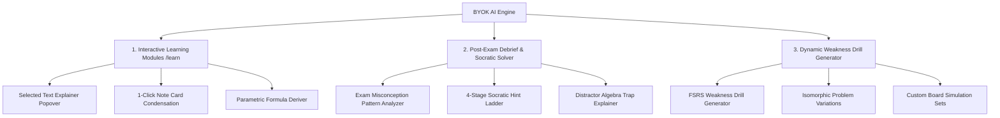
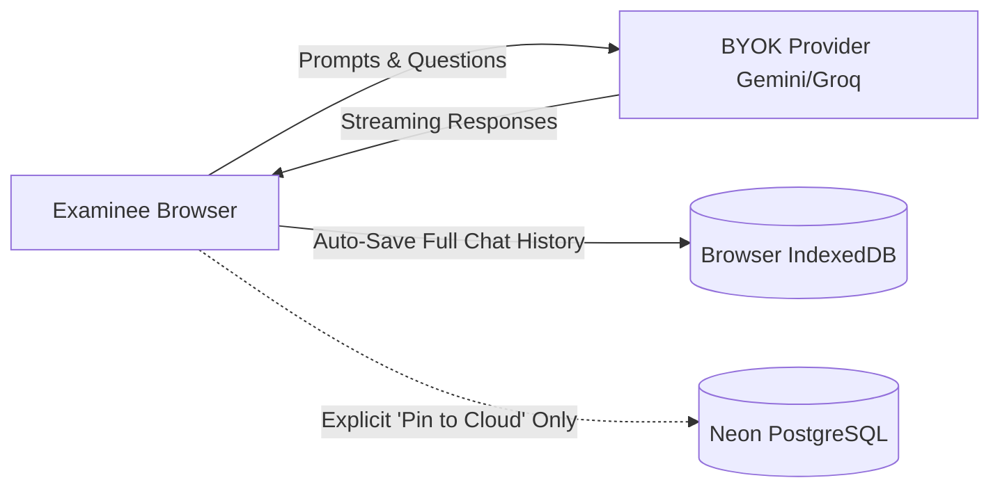
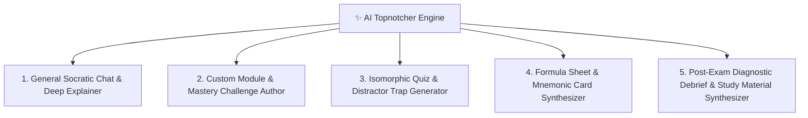
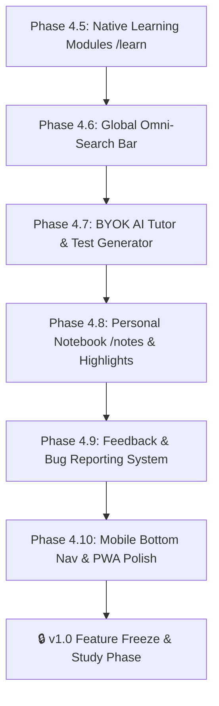

# Board Exam Review Platform — Unified Master Implementation Plan & Architecture

> **Single Source of Truth** for architecture, data schema, spaced repetition engine, board exam taxonomy, UI design, and development roadmap.
> **Guiding Principle:** A reliable, high-performance, $0-cost personal and peer review platform for the PRC Electronics Engineering (ECE) Board Examination.

---

## 1. Project Overview & Core Philosophy

The platform is designed to provide an optimal study experience for PRC ECE board examinees through three interlocking systems:
1. **Curriculum Engine:** Comprehensive coverage of all 4 PRC Board Subjects across 46 distinct, continuous topic codes (MATH 01–13, ELEC 01–15, GEAS 01–14, EST 01–10) with 5,435 official reference questions structured into four standardized tiers: *Diagnostic (30Q)*, *Review (25Q)*, *Drill (10–20Q)*, and *Simulation (50Q)*.
2. **Spaced Repetition & Retention Engine (SRS):** An empirical memory stability and retrievability model ($S = S_0 \cdot e^{\Delta t / S}$) providing personalized Daily Retention Radars, Per-Subject Recovery Drills, 1d/3d/7d snooze controls, and honest, calibrated Board Readiness Indices ($BRI$).
3. **Dual-Mode Visual Interface:** A flexible experience allowing students to switch between a structured, subtopic-filterable **Library List View** and a gamified, winding **Duolingo-Style Skill Tree** featuring true fractional SVG progress arcs and accuracy-driven chromatic rings.

---

## 2. Hard Constraints ($0 Forever & Security)

- **$0 Permanent Free Tier:** Hosted on Vercel Edge with Neon PostgreSQL Serverless ($0 hobby tier) and Drizzle ORM. Zero paid dependencies, zero converting free trials.
- **Server-Side Grading:** Grading and score calculations are strictly computed server-side in API routes; client payloads are never trusted for grading.
- **Declarative & Safe Visualizations:** No arbitrary runtime JavaScript evaluation (`new Function` / `eval`). Interactive modules use typed, declarative React/SVG components parameterized by JSON schemas, eliminating XSS risks and protecting client-side BYOK API keys.
- **Git-Lean Asset Strategy:** To avoid repository bloat and GitHub storage limits, diagrams are generated programmatically (lightweight SVGs or Python/matplotlib/schemdraw vector assets) rather than committing heavy raster images.
- **Secret Hygiene:** Database credentials and auth secrets live strictly in `.env.local` and Vercel project environment settings—never in git commits.

---

## 3. PRC Board Exam Master Syllabus & Course Code Taxonomy

The platform enforces an unbroken, 1-to-1 course code taxonomy across all four subjects, resolving all legacy numbering gaps:

```
========================================================================================
1. MATHEMATICS (MATH) — 1,170 Questions | 13 Continuous Course Codes
========================================================================================
• MATH 01 - College Algebra (19 Subtopics: 01-01 to 01-19)
• MATH 02 - Probability & Counting Techniques (13 Subtopics: 02-01 to 02-13)
• MATH 03 - Statistics (Measures of Central Tendency, Dispersion, Regression) [Decoupled]
• MATH 04 - Discrete Mathematics (Sets, Propositional Logic, Graph Theory) [Decoupled]
• MATH 05 - Plane & Spherical Trigonometry (Identities, Oblique, Napier's Rules)
• MATH 06 - Plane Geometry (Polygons, Circles, Chords, Power of a Point) [New Dedicated Set]
• MATH 07 - Solid Geometry (Prisms, Pyramids, Cylinders, Cones, Spheres) [Decoupled]
• MATH 08 - Solid Mensuration (Prismoidal Formula, Revolution Solids) [Decoupled]
• MATH 09 - Analytic Geometry (Lines, Conics, Polar Curves, 3D Quadrics)
• MATH 10 - Differential Calculus (Limits, Derivatives, Optimization, Rates)
• MATH 11 - Integral Calculus (Techniques, Areas, Volumes, Pappus Theorems)
• MATH 12 - Differential Equations (Separable, Exact, Linear, Bernoulli, Laplace) [Renumbered]
• MATH 13 - Advanced Engineering Mathematics (Complex Numbers, Vectors, Matrices, Fourier)

========================================================================================
2. ELECTRONICS ENGINEERING (ELECS) — 1,725 Questions | 15 Continuous Codes (No Gaps)
========================================================================================
• ELEC 01 - Electricity & Magnetism          • ELEC 09 - Operational Amplifiers (Op-Amps)
• ELEC 02 - Electrical Elements & Circuits    • ELEC 10 - Industrial Electronics & Thyristors
• ELEC 03 - DC Circuits & Network Theorems   • ELEC 11 - Power Supplies & Voltage Regulators
• ELEC 04 - AC Circuits, Phasors & Power     • ELEC 12 - Microelectronics & IC Fabrication
• ELEC 05 - Transients & Resonant Circuits   • ELEC 13 - Electronic Test & Measurement
• ELEC 06 - Semiconductor Physics & Diodes   • ELEC 14 - Feedback & Oscillators
• ELEC 07 - Bipolar Junction Transistors     • ELEC 15 - Digital Electronics & Logic Circuits
• ELEC 08 - Field Effect Transistors (FET)

========================================================================================
3. GENERAL ENGINEERING & APPLIED SCIENCES (GEAS) — 1,380 Questions | 12 Distinct Codes
========================================================================================
• GEAS 01 - Chemistry for Engineers          • GEAS 09 - Electromagnetics
• GEAS 02 - Physics 1 (Mechanics, Sound)     • GEAS 10 - ECE Laws, Ethics & Contracts (RA 9292)
• GEAS 03 - Physics 2 (EM, Optics, Modern)   • GEAS 11 - Material Science & Engineering
• GEAS 04 - Mechanics & Strength of Materials• GEAS 12 - Computer Programming & IT
• GEAS 05 - Thermodynamics & Heat Transfer   • GEAS 13 - Environmental Science & Engineering
• GEAS 06 - Engineering Economics            • GEAS 14 - Technopreneurship 101

========================================================================================
4. ELECTRONICS SYSTEMS & TECHNOLOGIES (EST) — 1,160 Questions | 10 Continuous Codes
========================================================================================
• EST 01 - Fundamentals of Comms & Noise     • EST 06 - Microwave Communications & Radar
• EST 02 - Radiowave Propagation             • EST 07 - Optical Fiber Communications
• EST 03 - Analog Modulation (AM, FM, PM)    • EST 08 - Telephony & Switching Systems
• EST 04 - Transmission Lines & Smith Charts • EST 09 - Digital Communications (PCM, PSK, QAM)
• EST 05 - Antennas & Radiation Systems      • EST 10 - Data Communications & Networks (OSI)
========================================================================================
TOTAL SYLLABUS BENCHMARK: 46 TOPICS • 190 QUESTION SETS • 5,435 QUESTIONS
========================================================================================
```

---

## 4. Spaced Repetition (SRS) & Diagnostic Architecture

### 4.1. Memory Engine & Retrievability Formula
The SRS engine tracks topic-level memory stability using an exponential forgetting curve:
$$R(t) = \exp\left( - rac{\Delta t}{S} 
ight)$$
- **Stability Update on Attempt ($S'$):**
  $$S' = S \cdot \left( 1 + c \cdot 	ext{Score} \cdot e^{-R} 
ight)$$
- **Retrievability Categories:**
  - 🟢 **Fresh ($R \ge 85\%$):** Memory intact; review not yet urgent.
  - 🟡 **Review Due ($R < 85\%$ or $\Delta t \ge S$):** Optimal retrieval window.
  - 🔴 **Struggling ($R < 60\%$ or $	ext{Score} < 70\%$):** Requires immediate active recall recovery.

### 4.2. Per-Subject & Overall Daily Recovery Drills
To prevent cognitive overload as students advance across multiple board areas:
1. **Global Daily Recovery Drill:** Aggregates 15–20 high-yield questions from all due topics across all 4 subjects.
2. **Per-Subject Recovery Drills:** Individual 10–15 question targeted refresher drills for each specific board subject (`Start Math Refresher`, `Start Elecs Refresher`, `Start GEAS Refresher`, `Start EST Refresher`).
3. **Student Agency Controls:**
   - **Granular Snooze:** Defer review for **1 Day (Default)**, **3 Days**, or **7 Days**.
   - **Confidence Presets:** Manually set memory intervals (Struggling: 1d, Moderate: 4d, Confident: 10d, Mastered: 30d).
   - **Topic Suspension:** Ignore non-relevant or already mastered areas.

### 4.3. Calibrated Board Readiness Index ($BRI$)
$$BRI = 	ext{Accuracy} 	imes 	ext{Average Retention} 	imes \sqrt{rac{	ext{Completed Topics}}{46}}$$
- **Calibration Safeguard:** Displays `"Calibrating Baseline (X / 3 sets)"` until $\ge 3$ sets ($50+$ Qs) are completed, preventing inflated initial estimates.

---

## 5. UI Architecture & Gamified Progression

### 5.1. Dual-View Interface (`/quizzes`)
- **List View:** Systematic accordion hierarchy grouped by subject and topic with subtopic range filters (`01-01 to 01-07`, `01-08 to 01-19`), set count badges, and sleek segmented context menus.
- **Duolingo-Style Skill Tree Map:**
  - **Compact Vertical Rhythm:** Optimized vertical stepping-stone spacing to eliminate excessive scrolling while maintaining a natural winding snake flow.
  - **Fractional SVG Progress Arcs:** Progress circles are not binary. The outer ring renders an SVG stroke arc matching the exact completion ratio ($	ext{Answered Sets} / 	ext{Total Sets}$).
  - **Chromatic Performance Rings:**
    - 🟢 Green: High Retention ($R \ge 85\%$) & High Accuracy ($\ge 80\%$)
    - 🟡 Amber: Moderate / Due for Review ($R < 85\%$)
    - 🔴 Red: Struggling / Low Score ($R < 60\%$ or $< 70\%$)
    - ⚪ Dark Slate: Unstudied ($0\%$ completion arc)
  - **Standardized Visual Hierarchy:** Removed arbitrary crowns and hardcoded colors; all nodes follow consistent, data-driven styling.

---

## 6. Native Interactive Learning Modules & Pedagogical Architecture

### 6.1. Pedagogical Tone & Accessible Standard English
- **Accessible, Clear & Direct:** Professional textbook clarity without archaic jargon, calibrated for high readability by Filipino examinees and ESL learners.
- **Intuitive Dual-Anchor Framing:**
  1. **Direct Intuition & Mental Models:** Plain-English conceptual explanations (e.g., water pipes for electrical potential, rate of turning for derivatives).
  2. **Engineering Context:** Practical board exam applications (e.g., transmission line impedance matching on cell towers).

### 6.2. "Long Academic Method vs. Board Exam Shortcut" Technique Catalog
- Every module contrasts classical textbook derivations with high-speed PRC board exam shortcuts:
  - *"This is the typical solution or long method. When in the boards, the following technique or solution would be faster."*
  - **Examples:**
    - *Parallel Lines:* Skip slope-intercept algebra; inspect matching ratio of $x$ and $y$ coefficients.
    - *Roots & Factorization:* Skip manual factoring; use Casio `CALC` mode or `EQN` mode.
    - *Limits with Indeterminate Forms:* Skip trigonometric factoring; apply L'Hôpital's Rule or test values near the limit with `CALC 0.9999`.
- **End-of-Module Strategy Catalog:** A comprehensive summary table indexing all common question archetypes for that topic and their matching speed shortcuts.

### 6.3. Puzzle-Game Progression & Paired 1-to-1 Mastery Sets
Following puzzle-game design principles (*Introduce in Isolation $\to$ Practice Isolated Mechanic $\to$ Apply with Creative Complexity*):
1. **In-Module Micro-Checkpoints (8–15+):** Introduce techniques one-by-one with immediate, low-friction checks.
2. **Paired 1-to-1 Mastery Challenge Test Set:**
   - Each module links directly to a partnered 20–30 question **Mastery Challenge Set**.
   - Tests every single shortcut and concept taught in the module with realistic, challenging board exam numbers, tricky distractor options, and multi-concept combinations.

### 6.4. Visual Assets, Declarative Visualizers & Git-Lean Diagram Strategy
- **Declarative Visualizers (Zero Raw Executable Code in JSON):**
  - When interactive parameter sliders or graphs provide high pedagogical value (e.g., Conic Eccentricity Visualizer, RLC Resonance Frequency Response, AC Phasor Diagrams), they are built as **typed, pre-compiled React/SVG components**.
  - Module JSON files only provide structured declarative parameters (e.g., `type: "conic_explorer"`, `params: { a: 5, b: 3, e: 0.8 }`, `controls: [...]`).
  - Raw executable JavaScript strings (`renderFunction`) and dynamic `new Function()` / `eval()` executions are strictly prohibited, eliminating XSS vectors and protecting client-side BYOK API keys.
- **Git-Lean Vector Diagram Generation:**
  - **Programmatic SVG/Scripted Diagrams (Primary):** Technical schematics (circuits, logic gates, block diagrams, Smith charts) are generated via local Python scripts (`matplotlib`, `schemdraw`, vector SVGs) or inline SVGs.
  - **Zero Repository Clutter / Size Limits:** To respect GitHub file and repo size limits, heavy bitmap images (PNG/JPEG) are avoided in git commits. Scalable, lightweight vector graphics ($\le 10\text{ KB}$ per diagram) are used instead.
  - **Antigravity AI Generation (Targeted Conceptual Illustrations):** When a physical real-world analogy or non-schematic illustration is needed, images are generated via Antigravity image generation and compressed into modern web formats before referencing.

---

## 7. AI Tutor Architecture, BYOK Integration & Standardized Prompts

### 7.1. Bring-Your-Own-Key (BYOK) Architectural Model
To deliver intelligent AI tutoring, dynamic test generation, and personalized concept debriefs while maintaining our **hard constraint of $0 perpetual host infrastructure cost**, the platform operates on a **Bring-Your-Own-Key (BYOK)** model. 

Examinees provide their own free API keys in Settings (`/settings`), which are managed with strict client-side privacy:
- **Client-Side Key Vault:** API keys are stored exclusively in the browser's `localStorage` (with optional Web Crypto API / AES-GCM obfuscation). Keys are never written to the Neon PostgreSQL database, never logged, and never transmitted to third parties.
- **Direct Client-to-Provider & Stateless Edge Proxy:** Requests execute either directly from the client browser to provider endpoints (using CORS-enabled SDKs) or via an ephemeral, stateless Next.js edge route (`/api/ai/proxy`) that attaches the examinee's client-supplied key without logging.

| Provider | Recommended Model | Free Tier Allocation | Key Strengths & Use Cases |
|---|---|---|---|
| **Google AI Studio** *(Primary)* | `gemini-1.5-flash` / `gemini-3.6-flash` | **15 RPM • 1M TPM • 1,500 RPD** | Massive 1M+ context window, superior multi-step math/circuit reasoning, generous permanent free tier. Ideal for deep module analysis and full-length exam debriefs. |
| **Groq Cloud** *(Secondary)* | `llama-3.3-70b-versatile` | **30 RPM • 14,400 RPD** | Ultra-low latency (>300 tokens/sec), instant streaming feedback. Ideal for real-time Socratic hint chats and quick 10-second math shortcut derivations. |
| **OpenRouter** *(Fallback)* | `meta-llama/llama-3.3-70b:free` / `deepseek-chat` | **Variable Free Quotas** | Universal OpenAI-compatible gateway; single key provides access to multiple backup open models during provider outages. |

#### Client-Side Automatic Failover Router
A resilient client router dispatches requests to the primary provider (Google AI Studio), seamlessly catching rate limits (HTTP 429), timeouts, or service errors, and failing over to secondary providers without interrupting the examinee:

```typescript
// platform/lib/ai/router.ts
export interface UserApiKeys {
  google?: string;
  groq?: string;
  openrouter?: string;
}

export async function fetchAITutorStream(
  messages: Array<{ role: "system" | "user" | "assistant"; content: string }>,
  keys: UserApiKeys,
  options?: { jsonMode?: boolean; schema?: any }
): Promise<ReadableStream<Uint8Array>> {
  const providers = [
    { name: "google", fn: () => callGeminiStream(messages, keys.google!, options) },
    { name: "groq", fn: () => callGroqStream(messages, keys.groq!, options) },
    { name: "openrouter", fn: () => callOpenRouterStream(messages, keys.openrouter!, options) },
  ].filter(p => !!keys[p.name as keyof UserApiKeys]);

  if (providers.length === 0) {
    throw new Error("No AI API keys configured. Please add a free Google Gemini or Groq key in Settings.");
  }

  let lastError: Error | null = null;
  for (const provider of providers) {
    try {
      return await provider.fn();
    } catch (err: any) {
      console.warn(`[AI Router] Provider ${provider.name} failed (${err.message}). Falling back to next provider...`);
      lastError = err;
    }
  }

  throw new Error(`All configured AI providers failed. Last error: ${lastError?.message || "Unknown error"}`);
}
```

---

### 7.2. Multi-System Integration Matrix
The BYOK AI engine is deeply interwoven into three foundational review workflows:



#### System A: AI-Generated Notes & Module Supplements (`/learn` and `/notes`)
1. **Selected-Text Explainer Popover:** While reading any learning module, selecting a paragraph or formula displays a floating action bar:
   - `[ 💡 Explain Intuitively ]`: Converts dense academic derivations into physical analogies (e.g., hydraulic analogy for voltage, momentum for inductors).
   - `[ ⚡ Derive Board Shortcut ]`: Generates a $\le 15\text{s}$ calculator technique or ratio shortcut for the selected concept.
   - `[ 📝 Save to Notes ]`: Formats the explanation into our standardized note card and saves it.
2. **Formula Sheet & Mnemonic Synthesizer:** Compiles all formulas from a topic into a condensed 1-page cheat sheet with memory anchors.

#### System B: AI Explainers & Socratic Tutor (`/quizzes` Runner & `/attempts/[id]/results`)
1. **Post-Exam Automated Debriefing:** On the exam results screen, clicking **"🤖 Start AI Exam Debrief"** analyzes all incorrectly answered questions across the attempt, identifying root error archetypes:
   - *Formula Misapplication* (e.g., used series impedance formula in a parallel branch).
   - *Unit & Conversion Traps* (e.g., forgot $\text{kHz} \to \text{Hz}$ or $\text{dB} \to \text{Linear}$).
   - *Stem Misreading* (e.g., missed *"which of the following is NOT..."*).
2. **4-Stage Socratic Hint Ladder:** During practice drills (or post-exam review), the AI acts as a patient coach, delivering progressive hints rather than immediately spoiling the answer:
   - *Level 1 (Intuitive Hook):* Reminds the student of the core physical principle without math.
   - *Level 2 (Governing Formula):* Displays the exact formula in KaTeX.
   - *Level 3 (Algebraic Setup):* Shows the numerical substitution with given values.
   - *Level 4 (Board Exam Shortcut & Keystrokes):* Unlocks the 15-second Casio/Karce/Canon keystroke shortcut.

#### System C: Dynamic Test-Set & Weakness Drill Generator
1. **"Target My Weaknesses" Generator:** Using the examinee's live FSRS Retention Radar, the AI generates a customized 10-question drill focused precisely on subtopics where Retrievability $R < 70\%$ or recent accuracy was low.
2. **Isomorphic Problem Generator:** Generates parallel practice problems with randomized parameters and fresh distractor numbers to test deep mathematical mastery and prevent rote memorization of answer keys.

---

### 7.3. Parsing Rigor, Math Rendering & Structured Output Guarantees
To prevent malformed LaTeX, broken JSON schemas, or garbled text from degrading the examinee's experience, the platform enforces strict structural formatting safeguards:

#### 1. Mathematical Notation Standards (KaTeX)
The AI system prompts strictly mandate standard LaTeX math syntax:
- **Inline Formulas:** Must be enclosed in single dollar signs: `$E = mc^2$`, `$\text{GCF}(a,b) = 24$`.
- **Display / Block Equations:** Must be enclosed in double dollar signs: `$$\int_0^\infty e^{-st} f(t) \, dt$$`.
- **Pre-Sanitization Engine (`MathText`):** Before rendering, all AI outputs pass through a resilient regex pre-processor in [`platform/components/math-text.tsx`](file:///c:/Users/reyna/OneDrive/Documents/marnie_quiz/platform/components/math-text.tsx) that:
  - Replaces isolated brackets `\[ ... \]` and `\( ... \)` with standard `$$ ... $$` and `$ ... $`.
  - Normalizes unescaped LaTeX backslashes (e.g., `\alpha`, `\frac`, `\sqrt`).
  - Renders markdown tables, headers, and bulleted lists cleanly alongside math.

#### 2. Strict Structured Outputs & Schema Auto-Repair
When generating dynamic quiz sets, the system leverages native JSON mode (`response_format: { type: "json_object" }` on Gemini and Groq) with a strict TypeScript/Zod schema:

```typescript
// Dynamic Quiz Question Schema
export interface AIGeneratedQuestion {
  stem: string;
  options: {
    A: string;
    B: string;
    C: string;
    D: string;
  };
  correctChoice: "A" | "B" | "C" | "D";
  formalSolution: string;
  shortcutSolution: string;
  distractorTraps: {
    A?: string;
    B?: string;
    C?: string;
    D?: string;
  };
  calculatorKeystrokes?: string;
}
```

- **Resilient JSON Parser:** If a provider output contains markdown code fences (````json ... ````), leading/trailing commentary, or trailing commas, the client parser automatically strips wrappers and sanitizes syntax before validation.

---

### 7.4. Conversation Storage Strategy: 100% Local-First Storage
To honor our **$0 perpetual cost rule**, preserve complete examinee privacy, and eliminate database bloat, the platform implements a **Local-First Conversation Architecture**:



#### 1. Zero Conversational Chat Logs in Neon PostgreSQL
- **Zero Database Bloat:** Raw AI chat transcripts, Socratic dialogue logs, and debugging sessions are **NEVER saved to Neon PostgreSQL**.
- **Privacy First:** Chat histories reside solely on the examinee's physical device.
- **Zero Connection Overhead:** Massive multi-turn conversations do not consume serverless DB compute hours or database storage quota.

#### 2. Local Storage Implementation (`IndexedDB` via `idb-keyval`) & Study Vault
- All conversational threads, query history, and private settings are stored locally in the browser's **IndexedDB** under `marnie_ai_conversations` and `marnie_byok_vault`:
  ```typescript
  export interface LocalConversationThread {
    id: string; // UUID
    type: "module_explainer" | "post_exam_debrief" | "socratic_tutor" | "weakness_drill" | "freeform_query";
    contextId?: string; // e.g. "math-01-01" or attemptId
    topicCode?: string; // e.g. "MATH-01"
    title: string;
    createdAt: number;
    updatedAt: number;
    messages: Array<{
      id: string;
      role: "user" | "assistant" | "system";
      content: string;
      timestamp: number;
    }>;
  }
  ```
- **Storage Limits & LRU Eviction:** IndexedDB provides $> 500\text{ MB}$ of local storage per origin—sufficient for tens of thousands of conversations. An automatic LRU (Least Recently Used) policy prunes unpinned conversations older than 90 days if local space exceeds $100\text{ MB}$.
- **1-Click Study Vault Backup & Restore (`.json` Sync at $0 Cost):**
  - **`[ 📥 Export Study Vault (.json) ]`**: Bundles all local AI conversations, custom notes, saved formula cards, and BYOK settings into a single structured file (`marnie-vault-YYYY-MM-DD.json`).
  - **`[ 📤 Import / Restore Vault ]`**: Allows examinees to import their study vault onto another device (e.g. laptop $\to$ phone) to restore all private AI queries and note cards without database sync fees.

---

### 7.5. Dedicated AI Workspace (`/tutor`) & 5 High-Yield Core Functions

A dedicated top-level navigation tab (`✨ AI Tutor` at `/tutor`) provides a full-featured workspace for AI-powered board review, directly integrating with the authoring workflows and schemas defined in `.agents/skills/`:



#### The 5 High-Yield Core Functions:

1. **General Socratic Chat & Deep Explainer:**
   - Freeform tutoring with automatic context injection of active module derivations, formulas, or quiz questions.
   - Delivers multi-level hints, intuitive mental models, and board exam trap warnings without spoiling numerical answers.

2. **Custom Learning Module & Paired Mastery Challenge Author:**
   - Leverages the pedagogy standards from `learning-module-authoring` and `mastery-challenge-authoring` to author standardized, fully valid `LearningModule` and 20-item `MasteryChallenge` JSON sets.
   - **Presets**: Freeform topic, pasted textbook/syllabus notes, or the **"Target My Weakest Topic"** preset (auto-selected from the examinee's live SRS Retrievability $R < 60\%$).
   - **Direct Actions**: `[ 📖 Save & Read Module ]` and `[ ⚡ Start Paired Mastery Challenge ]`.

3. **Isomorphic Practice Set & Distractor Trap Generator:**
   - Leverages `ece-test-authoring` standards to generate custom 10, 25, or 50-question drill sets.
   - Ingests past questions answered incorrectly, keeps the core concept archetype, but randomizes numerical parameters and crafts realistic distractor options based on common calculation slips (e.g. sign error, inverted fraction, radians/degrees omission).
   - **Direct Action**: `[ 🚀 Launch Custom Quiz Set ]` (grades server-side and logs to SRS).

4. **Formula Sheet & Mnemonic Card Synthesizer (Notebook Integration):**
   - Compiles subtopics into condensed KaTeX formula matrices, boundary conditions, and memory anchors/acronyms.
   - **Direct Action**: `[ 📌 Pin to My Notebook ]` (saved to local Study Vault and optional cloud notes).

5. **Post-Exam Root-Cause Diagnostic Debrief & High-Yield Study Material Synthesizer:**
   - Automatically ingests all missed questions from `/attempts/[id]/results` and classifies root errors into:
     - 🔴 *Conceptual Gap* (misunderstood fundamental physical law)
     - 🟡 *Formula Misapplication* (used series formula in parallel branch)
     - 🟠 *Algebra & Unit Traps* (missed $\text{kHz} \to \text{Hz}$ or $\text{dB} \leftrightarrow \text{Linear}$)
     - ⚪ *Stem Misreading* (missed *"which of the following is NOT"*)
   - Provides a $\le 15\text{s}$ calculator speed technique (Karce KC-S991 / Canon F-789SGA / Casio fx-991ES Plus) for each missed item.
   - **High-Yield Study Material Generation**: 1-click **`[ 📝 Generate Focused Review Sheet from Mistakes ]`** converts the debrief into a structured, printable study note card saved to the student's Study Vault.

#### Workspace Layout & Mobile Design:
- **Dual-Pane Desktop & Mobile Slide-Over Drawer:** Query history and saved threads are tucked in a sliding drawer on mobile (`< lg`) to provide 100% vertical viewport for chat.
- **Context Selector Ribbon:** Attach any active curriculum module (e.g., `[ 📎 MATH-22-02 Laplace ]`) with 1 click.
- **One-Tap Quick-Action Ribbon:** Horizontal scrolling prompt chips (`[ 🎯 Target Weakest Topic ]`, `[ 📝 Write Module + Exam ]`, `[ 🎲 10 Isomorphic Qs ]`, `[ 📋 Formula Sheet ]`, `[ 📊 Post-Exam Debrief ]`).
- **Fixed Mobile Bottom Composer:** Keyboard-avoidant input bar with safe-area insets (`env(safe-area-inset-bottom)`).


---

### 7.6. Standardized System Prompts & Structured Card Schemas

#### Persona System Prompt: PRC ECE Board Exam Topnotcher Mentor
```markdown
You are an expert PRC Electronics Engineering (ECE) Board Examination Topnotcher Mentor.
Your mission is to provide crisp, intuitive, high-speed explanations and derivations for engineering examinees.

CRITICAL PEDAGOGICAL GUIDELINES:
1. Ground every mathematical concept in intuitive standard English; eliminate academic fluff.
2. Always contrast the typical academic long derivation with the fastest PRC board exam shortcut or Casio/Karce/Canon calculator technique.
3. Use exact KaTeX formatting: `$ ... $` for inline math and `$$ ... $$` for display equations.
4. When explaining missed questions, explicitly identify the distractor trap (e.g. sign error, inverse ratio, unit conversion trap).
5. When asked to generate notes, format them strictly according to the Standardized Note Card Schema.
```

#### Standardized Note Card Output Schema
```markdown
### 💡 [Topic / Concept Title]

**1. Intuitive Physical Principle:**
*Plain-English explanation of what is actually happening physically or geometrically.*

**2. Governing Formula & Parameters:**
$$\text{Formula in KaTeX}$$
- $V$: Parameter description and SI unit ($\text{Unit}$)
- $I$: Parameter description and SI unit ($\text{Unit}$)

**3. Board Exam Shortcut & Calculator Technique:**
- *Academic Long Method:* [1-sentence summary of typical long textbook derivation]
- *⚡ Board Exam Speed Technique:* [15-second shortcut, ratio trick, or Karce/Canon keystroke setup]

**4. ⚠️ Common Exam Distractor Trap:**
> [1 sentence explaining the classic algebraic or conceptual pitfall set by PRC board examiners]

**5. 📝 High-Yield Takeaway Rule:**
> [A crisp 1-sentence mnemonic or rule of thumb for instant recall]
```

---

### 7.6. Phased AI Tutor Roadmap

```
[➔] Phase 4.7: BYOK API Key Vault & Client-Side Failover Router
    • Secure localStorage key management for Google AI Studio, Groq Cloud, OpenRouter
    • Zero-latency automatic failover router with HTTP 429 catch and fallback

[➔] Phase 4.8: In-Module Context AI Explainer & Local Chat Storage
    • Floating text selection toolbar in /learn reader ([Explain Intuitively], [Derive Shortcut])
    • Local IndexedDB conversation history store with JSON/Markdown export

[➔] Phase 4.9: Post-Exam AI Debriefing & Socratic Hint Ladder
    • 1-Click "Start AI Exam Debrief" on /attempts/[id]/results analyzing missed questions
    • 4-level progressive Socratic hint modal inside practice drills

[➔] Phase 4.10: Dynamic Weakness Drill & Isomorphic Question Generator
    • FSRS-driven "Target My Weaknesses" drill generator with structured JSON schema validation
    • 1-Click "Save AI Note" persistence to Neon DB /notes repository
```

---

## 8. Implementation Phasing & Status

```
[✓] PHASE 1: Full-Stack Core Platform & Live Database Migration
    • Next.js 16 App Router + Tailwind CSS + Drizzle ORM + Neon PostgreSQL Serverless
    • 190 question sets (5,435 questions) across 4 subjects
    • Server-side grading, guest-mode access, Vercel edge deployment

[✓] PHASE 2: Spaced Repetition Engine & Memory Analytics
    • FSRS Stability & Retrievability engine with Daily Retention Radar
    • 15–20 question daily recovery drill with 1d/3d/7d snooze and confidence overrides
    • Board Readiness Index with calibration thresholds and true syllabus benchmarks

[✓] PHASE 3: Gamified Skill Tree & Intelligent Ingestion
    • Duolingo-style winding stepping stone pathway with interactive practice drawers
    • 3-Layer CSV ingestion with heuristic NLP auto-tagging into 8 cognitive archetypes
    • Sleek segmented context popovers and gamification streaks/badges

[➔] PHASE 4: Subtopic Granularity, Decoupled Math Syllabus & Learning Modules (NEXT SESSION)
    • Task 4.1: Decouple Math Syllabus (Split MATH 03/04, 07/08, generate MATH 06, renumber 12/13)
    • Task 4.2: Subtopic Range Grouping UI Toggle (Filter sets by range e.g. 01-01 to 01-07)
    • Task 4.3: Per-Subject Daily Recovery Refresher Drills (Math, Elecs, GEAS, EST)
    • Task 4.4: Fractional SVG Progress Arcs & Performance Color Rings on Skill Tree
    • Task 4.5: Standardized Learning Module Generator & Dedicated /learn Tab
    • Task 4.6: Comprehensive UI Clutter & Visual Hierarchy Audit
    • Task 4.10: Lightweight In-App Feedback Widget
      - Discreet, low-friction "💬 Got feedback / Report error?" button in footer and Quiz Results screens.
      - 1-click issue reporting for formula typos or errata, stored directly in Neon DB.

[ ] PHASE 5: Mobile PWA & Offline Access (FUTURE)
    • Service Worker caching for offline practice and PWA install manifest

[ ] PHASE 6: Product Case Study & Public Portfolio Release (EARLY OCTOBER 2026)
    • Collate real-world study data, examinee retention metrics, and peer feedback.
    • Publish technical product case study and LinkedIn portfolio write-up highlighting:
      - AI-native systems architecture and $0 infrastructure design (Neon + Vercel).
      - Empirical FSRS memory stability modeling for licensure board exams.
      - Product trade-offs, calibration gating, and domain-specific pedagogy.
    • Service Worker caching for offline practice and PWA install manifest
```


---

## 9. Definition of "Complete" (Feature Freeze & Active Study Mode)

To prevent perpetual scope creep and ensure the tool fulfills its primary purpose—**helping you and your friends pass and top the ECE Board Exam**—we establish an explicit, non-negotiable **Definition of Done (v1.0 Complete)**:

```
┌──────────────────────────────────────────────────────────────────────────────────┐
│  🏁 THE V1.0 "PLATFORM COMPLETE" DEFINITION OF DONE (DoD)                         │
│                                                                                  │
│  The platform is 100% COMPLETE when the following 4 pillars are delivered:       │
│                                                                                  │
│  1. CURRICULUM: 46 1-to-1 Decoupled Topics (MATH 01-13, ELEC 01-15,            │
│     GEAS 01-14, EST 01-10) with all 190 sets (5,435 questions) verified.       │
│  2. RETENTION: Working SRS Radar, Per-Subject Recovery Drills, and Calibrated    │
│     Board Readiness Index (BRI).                                                 │
│  3. LEARNING: Native interactive /learn/[topic] modules with speed shortcuts     │
│     and paired mastery sets.                                                     │
│  4. AI TUTOR: BYOK (Google AI Studio/Groq) post-exam debrief and /notes repo.   │
└──────────────────────────────────────────────────────────────────────────────────┘
```

### The Post-Completion Operating Rule:
1. **Immediate Feature Freeze:** Upon completing Phase 4, active development halts completely.
2. **Shift to Pure Examinee Mode:** The platform shifts into daily review, exam simulations, and spaced repetition practice.
3. **Passive Feedback Collection Only:** Any new feature idea, layout tweak, or enhancement request must be logged to a static `FEEDBACK_LOG.md` without writing new code, deferred until after the board exam.


---

## 15. Mobile Friendliness & PWA Optimization Strategy

To ensure seamless board-exam study on mobile devices (smartphones and tablets) during commutes, library sessions, and quick reviews, the following architectural and UX enhancements are planned:

### 15.1 Touch-First Ergonomics & Layout
- **Thumb-Zone Navigation:** Place core navigation (Library, Retention Radar, History, Daily Drill CTA) in a fixed bottom tab bar for mobile viewports (`< 640px`), eliminating top-screen reaching.
- **Large Touch Targets:** Enforce minimum $48 \times 48\text{px}$ touch targets for all multiple-choice answer buttons (`choiceA` through `choiceD`), popovers, and pagination controls.
- **Swipe Gestures:** Support horizontal swipe gestures in the Quiz Runner (`quiz-runner.tsx`) to seamlessly advance to the next question or return to the previous question without needing to tap pagination arrows.

### 15.2 Compact Layout & Bottom Sheets
- **Drawer Modals as Bottom Sheets:** Convert full-screen and centered modals (e.g. topic set launcher, filter sheets, FSRS manual override dialogs) into native-feeling swipeable bottom sheets on mobile screens (`max-h-[80vh]` with top grab handles).
- **Responsive KaTeX & Math Equations:** Wrap complex math equations and long formulas in auto-overflow horizontal scroll containers (`overflow-x-auto overflow-y-hidden text-sm sm:text-base py-1`) to prevent viewport breakage and text cutoff.
- **Responsive Tables & Matrix Grids:** Convert wide multi-column analytics tables into collapsible card views on viewports $< 768px$.

### 15.3 Offline Support & Progressive Web App (PWA)
- **Web App Manifest (`manifest.json`):** Configure standalone app metadata, icons, theme color, and fullscreen display so examinees can "Add to Home Screen" on iOS and Android.
- **Service Worker Caching (Workbox):** Cache static assets, KaTeX fonts, and seed question sets locally for offline review when studying in low-connectivity exam rooms or transit.
- **Viewport Safe Area Insets:** Apply `env(safe-area-inset-bottom)` and `env(safe-area-inset-top)` padding for iPhone dynamic islands and Android navigation notches.


### 4.9 In-App Feedback & Contextual Bug Reporting Pipeline
- **Top Bar "Give Feedback" Modal:**
  - Accessible via a sleek **"Feedback"** link in the top navbar and footer.
  - Allows examinees to submit feature suggestions, general usability feedback, or praise.
- **Contextual "Report Issue with Question" CTA:**
  - In the Quiz Runner (`quiz-runner.tsx`) and Post-Exam Review (`/attempts/[id]/results`), each question includes a small **"🚩 Report Error"** flag.
  - Automatically captures `questionId`, `promptText`, `selectedChoice`, `correctChoice`, and examinee's error description (e.g., typo in equation, ambiguous distractor, wrong key answer).
- **Global Error Boundary Fallback:**
  - Standard Next.js error boundary (`error.tsx`) displaying a friendly *"Something went wrong"* card with a 1-click **"Report Bug"** button capturing error name, route, and user agent.
- **Database Schema (`feedback_reports`):**
  ```ts
  export const feedbackReports = pgTable("feedback_reports", {
    id: uuid("id").defaultRandom().primaryKey(),
    userId: uuid("user_id"),
    type: varchar("type", { length: 30 }).notNull(), // "general_feedback" | "question_error" | "app_bug"
    questionId: uuid("question_id"),
    route: varchar("route", { length: 255 }),
    message: text("message").notNull(),
    metadata: jsonb("metadata"),
    status: varchar("status", { length: 20 }).default("open"),
    createdAt: timestamp("created_at").defaultNow(),
  });
  ```

---

## 5. Sequential Execution Steps to v1.0 Feature Freeze

To execute the remainder of Phase 4 and lock in the permanent v1.0 feature freeze:



### Step 1: Phase 4.5 — Interactive Learning Modules & Mastery Challenges (`/learn`)
- Build the dynamic `/learn` and `/learn/[moduleId]` pages with the lesson-first pedagogical hierarchy, 4-layer narrative theory, high-visibility compilation of formulas cards (`formulas`), declarative vector SVG figures (`InlineFigure`), and decoupled 20–25 question companion Mastery Challenges (`/learn/[moduleId]/mastery`).
- **Strict 1-to-1 Note Page Authoring Standard**: Every module is engineered directly from rendered review note page PNGs in `test-sets/scratch/pdf-renders/[subject]/notes___[topic]_[n]/page_01.png` per [modules-authoring-plan.md](file:///c:/Users/reyna/OneDrive/Documents/marnie_quiz/test-sets/Reference%20Documents/modules-authoring-plan.md).
- Follow phased roadmap: Phase 1 (44 Mathematics note pages), Phase 2 (R.A. No. 9292 Deep Law), Phase 2.5 (GEAS Concepts), Phase 3 (GEAS Physics/Mechanics/Econ), Phase 4 (EST), Phase 5 (ELECS).

### Step 2: Phase 4.6 — Global Omni-Search Bar (`/` Shortcut)
- Build the client-side fuzzy search dialog accessible from the navbar or pressing `/`.
- Search instantly across all 202 test sets, 50 topics, and learning modules.

### Step 3: Phase 4.7 — BYOK AI Tutor & Post-Exam Debriefing
- Create the client-side BYOK key management modal (`localStorage` encryption).
- Implement multi-provider failover routing (Google AI Studio $	o$ Groq $	o$ OpenRouter).
- Add post-exam AI debriefing on `/attempts/[id]/results` and 1-click **"Target My Weaknesses"** test generator with RFC4180 fail-safe auto-repair.

### Step 4: Phase 4.8 — Unified Personal Notebook (`/notes`)
- Implement text selection floating popover (`[ 🖍️ Highlight | 🔖 Bookmark | 🤖 Ask AI | 📝 Save Note ]`).
- Build `/notes` page with subject tabs, keyword search, and 1-click AI formula cheat sheet condensation.

### Step 5: Phase 4.9 — Feedback & Contextual Bug Reporting
- Add `feedbackReports` Drizzle schema in Neon PostgreSQL.
- Add "Give Feedback" navbar dialog and "🚩 Report Error" question flag in quiz runner and results.

### Step 6: Phase 4.10 — Mobile Ergonomics & PWA Final Polish
- Add mobile bottom navigation bar (`< 640px`), `manifest.json`, and safe-area padding.
- Verify `npm run build` with 0 errors across all routes.

### Step 7: Phase 4.11 — Customizable Daily Refresher Quiz (Post-Module Enhancement)
- Add a **"Customize Refresher"** option/modal on the Daily Drill trigger:
  - **Subject Filter:** Choose between All Subjects (default 20-item mix) or target a single specific subject (e.g. Mathematics, Electronics, EST, GEAS).
  - **Target Mode:** Toggle between "All Due SRS Items" or "Failed & Low-Accuracy Items Only".
  - **Configurable Length:** Select test length (10, 20, or 30 questions) depending on available study time.
- **Declare v1.0 Feature Complete & Enter Pure Study Mode.**

---

## 16. Future Sessions & Post-V1 Roadmap (V2 & Beyond)

The following architectural initiatives and product enhancements are formally logged and scheduled for post-exam / future V2 development sessions:

### 16.1. Google Drive Cloud Sync (`Save Progress to Google Drive`)
- **Objective:** Provide a 1-click cloud backup and multi-device sync solution for examinees without recurring server database costs.
- **Implementation Strategy:**
  - Leverage Google Drive REST API with standard OAuth `https://www.googleapis.com/auth/drive.appdata` (hidden application data folder) or user root.
  - Automatically or manually backup the **Study Vault** (custom modules, user notes, SRS retrievability vectors, quiz attempt logs, and theme settings) as an encrypted JSON archive.
  - 1-click **"Restore from Google Drive"** to easily migrate across smartphones, tablets, and laptops.

### 16.2. Dedicated Settings Center & Legal Compliance (`/settings`)
- **Objective:** Consolidate configuration, account management, and compliance documents into a unified, dedicated settings hub.
- **Core Sections:**
  1. **Account & Auth:** Manage Google OAuth profile, active sessions, and multi-device tokens.
  2. **AI BYOK Configuration:** Global default provider selection (Gemini, Groq, OpenAI, Anthropic, DeepSeek, OpenRouter), API key management, and temperature/creativity sliders.
  3. **Display & Reader Preferences:** Default formula display mode (`Fit Math` vs `Scroll Math`), KaTeX font scale, and theme presets.
  4. **Legal & Compliance:**
     - **Terms of Service (TOS):** User responsibilities, BYOK liability disclaimers, and fair-use study standards.
     - **Privacy Policy:** Transparent disclosure that API keys and personal notes are client-side only and never monetized or exposed.
     - **Non-Affiliation Disclaimer:** Explicit notice affirming independence from all commercial review centers and the Professional Regulation Commission (PRC).

### 16.3. Granular User Data Control & Privacy Suite
- **Objective:** Give students complete agency over their personal study data with fine-grained management controls.
- **Feature Set:**
  - **Selective Data Reset:**
    - *Reset Quiz Attempt Records* (wipes attempt history while preserving custom notes and learning module progress).
    - *Recalibrate SRS Memory Engine* (resets stability and retrievability curves to day 0).
    - *Wipe Personal Notes Vault* (`marnie_user_notes`).
    - *Wipe Custom AI Modules* (`marnie_tutor_custom_modules`).
  - **Full Data Export (GDPR / Portability):** 1-click zip bundle containing all study records, attempt CSVs, Markdown notes, and custom module JSONs.
  - **Account Termination:** 1-click permanent deletion of PostgreSQL user rows and cascading database progress.

### 16.4. Canonical TOS-Compliant PRC Taxonomy & Clean De-identification
- **Objective:** Cleanly decouple all syllabus course numbering and subtopic structures from commercial review center sequences (`MATH 01–13`, `ELEC 01–15`, `GEAS 01–14`, `EST 01–10`) to eliminate all proprietary traces for public release, open-source distribution, or future commercialization.
- **Standardized PRC Board Exam Taxonomy:**
  - **Mathematics (MATH):** `MATH-ALG-01` (Algebra), `MATH-PROB-01` (Probability), `MATH-STAT-01` (Statistics), `MATH-TRIG-01` (Trigonometry), `MATH-GEOM-01` (Geometry), `MATH-CALC-01` (Calculus), `MATH-DE-01` (Differential Equations), `MATH-ADV-01` (Advanced Engineering Math).
  - **Electronics (ELECS):** `ELECS-CKT-01` (Circuits), `ELECS-SEMI-01` (Semiconductors & Diodes), `ELECS-BJT-01` (Transistors), `ELECS-OPAMP-01` (Operational Amplifiers), `ELECS-DIGI-01` (Digital Logic), `ELECS-PWR-01` (Power Regulators).
  - **General Engineering (GEAS):** `GEAS-CHEM-01` (Chemistry), `GEAS-PHYS-01` (Physics), `GEAS-MECH-01` (Strength of Materials), `GEAS-THERMO-01` (Thermodynamics), `GEAS-ECON-01` (Engineering Economics), `GEAS-LAW-01` (R.A. 9292 ECE Law).
  - **Communications (EST):** `EST-COMM-01` (Modulation & Noise), `EST-PROP-01` (Radiowave Propagation), `EST-TXLINE-01` (Transmission Lines & Smith Charts), `EST-ANT-01` (Antennas), `EST-OPTIC-01` (Fiber Optics), `EST-DIGI-01` (Digital Communications & OSI).
- **Migration Pipeline:** A safe migration script to map legacy database records and JSON modules to canonical taxonomy keys without breaking existing user progress.

### 16.5. Module Content Authoring Backlog
- **GEAS Modules:** `geas-10-02.json` (Board of ECE, Powers & Scope), `geas-10-03.json` (Examination, Registration & Licensure), followed by Chemistry, Physics, and Thermodynamics modules.
- **EST & ELECS Modules:** Transmission lines, Antennas, BJTs, Op-Amps, and Digital Logic per [`modules-authoring-plan.md`](file:///c:/Users/reyna/OneDrive/Documents/marnie_quiz/test-sets/Reference%20Documents/modules-authoring-plan.md).

### 16.6. CI/CD Automation & Automated Quality Linting Pipelines
- **1. GitHub Actions CI Automation (`.github/workflows/ci.yml`):**
  - Triggers on every pull request and push to `main`.
  - Executes `npm run audit` (Module & Mastery validation), `npm run lint` (ESLint), and `npm run build` (Turbopack + TypeScript type-checking).
  - Guarantees that zero regressions, broken types, or un-audited test sets ever reach production.
- **2. KaTeX Math Syntax & Delimiter Linter:**
  - Automated regex and AST scanner across all markdown strings (`theoryHtmlMarkdown`, `formalSolutionMarkdown`, `shortcutSolutionMarkdown`, `distractorReason`).
  - Flags unclosed `$` delimiters, multiline paragraph math captures, and malformed LaTeX commands before they cause client-side rendering crashes.
- **3. Syllabus & TOS Mapping Integrity Validator:**
  - Verifies that every `topicCode` and `domain` across `test-sets/learning-modules/` matches an active key in `platform/lib/tos-mapping.ts`.
  - Prevents "orphan" modules and broken syllabus progress vectors.
- **4. CSV Question Bank Schema Validator (`/test-sets/csv/`):**
  - Verifies RFC4180 CSV compliance, mandatory headers (`question_text`, `choice_a`, `choice_b`, `choice_c`, `choice_d`, `correct_answer`, `explanation`, `archetype`, `domain`), and valid answer keys.

---

## 17. Study-First Milestone Guardrail (Platform Feature Freeze)

> [!IMPORTANT]
> **STUDY ANCHOR & PLATFORM WORK FREEZE:**
> **Do NOT resume platform engineering, UI features, or infrastructure refactoring until completing and mastering at least:**
> 1. 📐 **Analytic Geometry** (`MATH 07-01` to `MATH 07-04` — Lines, Conics, Polar Curves, and 3D Quadrics)
> 2. ⚖️ **ECE Laws, Ethics & Contracts (R.A. No. 9292)** (`GEAS 10-01` to `GEAS 10-03` — Enactment facts, Board Powers, Scope of Practice, Penal Provisions)
>
> The platform is in a stable, verified state (100% CI pass rate). Prioritize pure review and active retrieval over code edits.


