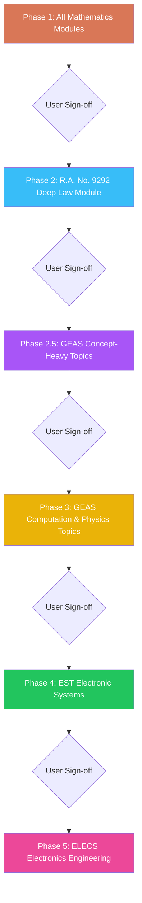

# Phased Learning Modules & Mastery Challenges Authoring Master Plan

This plan establishes the strict, phased execution roadmap for authoring all **56 Interactive Learning Modules** and **56 Paired Mastery Challenges** across Mathematics, GEAS, EST, and Electronics Engineering on the Marnie Quiz platform.

---

## 1. Operating Rules & Core Source of Truth

1. **Workflow Standard**:
   - Every module and companion mastery challenge MUST strictly follow the standard operating procedure defined in [`.agents/workflows/module-authoring-workflow.md`](file:///c:/Users/reyna/OneDrive/Documents/marnie_quiz/.agents/workflows/module-authoring-workflow.md).
2. **Pedagogical & Authoring Skills**:
   - [`.agents/skills/learning-module-authoring/SKILL.md`](file:///c:/Users/reyna/OneDrive/Documents/marnie_quiz/.agents/skills/learning-module-authoring/SKILL.md): Lesson-first hierarchy, 4-layer theory flow (Intuition $\to$ Formula $\to$ Specific Cases $\to$ Trap Alert), inline declarative SVG diagrams (`InlineFigure`), clean keycap arrays, and dual-method sample problems.
   - [`.agents/skills/mastery-challenge-authoring/SKILL.md`](file:///c:/Users/reyna/OneDrive/Documents/marnie_quiz/.agents/skills/mastery-challenge-authoring/SKILL.md): Decoupled 20–25 question exams with strict **4-Quadrant Balance Protocol** (30% conceptual, 35% computational, 20% applied, 15% shortcuts/traps) and direct distractor deconstructions.
3. **Quality & Error Prevention**:
   - [`test-sets/Reference Documents/learning-modules-authoring-pitfalls.md`](file:///c:/Users/reyna/OneDrive/Documents/marnie_quiz/test-sets/Reference%20Documents/learning-modules-authoring-pitfalls.md): Mandatory pre-flight checklist preventing academic jargon, faded text, missing slider tracks, or directory pollution.
4. **Phase Boundary & Gating Rule**:
   - **Strict Gating**: Build only the current authorized phase. **Do not proceed to the next phase without explicit approval from the user.**
5. **Strategic Milestone Pause**:
   - After completing Phase 1 (Mathematics) or Phase 2 (RA 9292), module authoring may be paused to finalize the **BYOK AI Features** (creating a complete, functional MVP) before resuming subsequent module batches on the side.

---

## 2. Phased Execution Roadmap

---

### Phase 1: All Mathematics Modules (Foundational Suite)

- **Goal**: Author all remaining 21 Mathematics learning modules and 21 companion mastery challenges.
- **Reference Blueprint**: [`test-sets/Reference Documents/modules-plan-math.md`](file:///c:/Users/reyna/OneDrive/Documents/marnie_quiz/test-sets/Reference%20Documents/modules-plan-math.md)
- **Status of Suite**:
  - `MATH-12-01`: Lines, Slopes, Angles & Distances `[x] Completed`
  - `MATH-12-02`: Shoelace Polygon Area & Centroids `[x] Completed`
  - `MATH-13-01`: Conic Sections: Circles & Parabolas `[x] Completed`
  - `MATH-13-02`: Conic Sections: Ellipses, Hyperbolas & Polar Conics `[x] Completed`
- **Modules to Author**:
  1. `MATH-01`: Number Theory, Operations & Special Sets
  2. `MATH-02`: Logarithms, Radicals & Exponents
  3. `MATH-03`: Polynomials, Factoring & Rational Expressions
  4. `MATH-04`: Equations, Inequalities & Partial Fractions
  5. `MATH-05`: Sequence, Series, Binomial Theorem & Progression
  6. `MATH-06`: Permutations, Combinations & Probability
  7. `MATH-07`: Set Theory, Venn Diagrams & Mathematical Logic
  8. `MATH-08`: Plane Trigonometry: Angle Measurements & Functions
  9. `MATH-09`: Trigonometric Identities, Equations & Inverse Functions
  10. `MATH-10`: Oblique Triangles & Spherical Trigonometry
  11. `MATH-11`: Solid Geometry: Prisms, Pyramids, Polyhedra & Platonic Solids
  12. `MATH-14`: Polar, Cylindrical & Spherical Coordinates
  13. `MATH-15`: Differential Calculus: Limits, Continuity & 37 Standard Derivatives
  14. `MATH-16`: Applications of Derivatives: Maxima/Minima, Rates & Curvature
  15. `MATH-17`: Integral Calculus: Integration Techniques, Wallis & Definite Integrals
  16. `MATH-18`: Applications of Integrals: Areas, Volumes, Lengths, Work & Centroids
  17. `MATH-19`: Differential Equations: 1st-Order, Exact, Linear & Applications
  18. `MATH-20`: Differential Equations: Higher-Order Linear & Damping Models
  19. `MATH-21`: Complex Numbers & Vector Algebra
  20. `MATH-22`: Matrices, Determinants & Linear Systems
  21. `MATH-23`: Advanced Transforms: Laplace, Fourier & Z-Transforms

---

### Phase 2: R.A. No. 9292 (Deep Law & Ethics Module)

- **Goal**: Author an exhaustive, high-yield learning module and companion 25-item mastery set for Republic Act No. 9292 (Electronics Engineering Law of 2004).
- **Reference Blueprint**: [`test-sets/Reference Documents/modules-plan-geas.md`](file:///c:/Users/reyna/OneDrive/Documents/marnie_quiz/test-sets/Reference%20Documents/modules-plan-geas.md) (`GEAS-17`) & Review Notes.
- **Special Directives**:
  - **Comprehensive Scope**: Must cover all **8 Articles and 43 Sections** of the law.
  - **High Detail**: Provide explicit breakdowns for:
    - Scopes of practice: Professional Electronics Engineer (PECE), Electronics Engineer (ECE), Electronics Technician (ECT).
    - Qualifications and requirements (e.g. PECE 7-year experience requirement, 3 certifiers).
    - Board composition, powers, qualifications, and 3-year term limits.
    - Licensure examination ratings: General average $\ge 70\%$ with no subject below $60\%$; Removal exams.
    - PECE Official Dry Seal dimensions ($48\text{ mm}$ outer, $32\text{ mm}$ inner diameter) and stamping rules.
    - Penal provisions: Fines ($\text{₱100,000}$ to $\text{₱1,000,000}$) and imprisonment ($6\text{ months}$ to $6\text{ years}$).
  - **Rich Concept Checks & Mental Anchors**: Memory pegs, article-to-topic matrices, and 1-second keyword associations.
  - **Files**: `geas-17.json` and `geas-17-mastery.json`.

---

### Phase 2.5: GEAS Concept-Heavy Topics (Qualitative & Memorization)

- **Goal**: Author all qualitative, definition-first GEAS modules that require minimal mathematical solving but high memory retention.
- **Reference Blueprint**: [`test-sets/Reference Documents/modules-plan-geas.md`](file:///c:/Users/reyna/OneDrive/Documents/marnie_quiz/test-sets/Reference%20Documents/modules-plan-geas.md)
- **Target Modules (8 Modules)**:
  1. **Chemistry Suite (`GEAS-01` to `GEAS-05`)**:
     - `GEAS-01`: Matter, Classification, Separation Techniques, SI Units, History of Atomic Models (Democritus, Dalton, Thomson, Rutherford, Bohr, Schrödinger, Chadwick).
     - `GEAS-02`: 4 Quantum Numbers ($n, l, m_l, m_s$), Aufbau/Hund/Pauli rules, Periodic Table History, Families & Electronegativity Trends.
     - `GEAS-03`: Gas Laws (Boyle, Charles, Gay-Lussac, Avogadro, Dalton, Graham effusion, Henry, Raoult) & Chemical Reaction Types.
     - `GEAS-04`: Solutions, Concentration Units (Molarity, Molality, Normality), Acids/Bases (Arrhenius, Brønsted-Lowry, Lewis), pH scale, and Tyndall effect.
     - `GEAS-05`: Electrochemistry (Galvanic/Electrolytic cells, Nernst equation), Organic Chemistry Functional Groups, and Polymers.
  2. **Material Science & Engineering (`GEAS-08`, `GEAS-09`)**:
     - `GEAS-08`: Crystal Unit Cells (Simple Cubic, Body-Centered Cubic, Face-Centered Cubic), Atomic Packing Factor (APF), and Miller Indices.
     - `GEAS-09`: Stress-Strain Curve points (Proportional limit, Elastic limit, Yield point, Ultimate tensile strength, Rupture point), Hardness scales (Mohs, Brinell, Rockwell), Magnetic classifications (Diamagnetic, Paramagnetic, Ferromagnetic, Curie temperature), and Metal Alloys (Steel, Brass, Bronze).
  3. **Technopreneurship & Intellectual Property (`GEAS-18`)**:
     - `GEAS-18`: Innovation life cycles, 9-block Business Model Canvas, Lean Canvas, Double-Entry Accounting equation ($\text{Assets} = \text{Liabilities} + \text{Equity}$), and R.A. 8293 IP Protection terms (Patents 20 yrs, Utility Models 7 yrs, Industrial Designs 15 yrs max, Trademarks 10 yrs, Copyrights Life+50 yrs).

---

### Phase 3: The Rest of GEAS (Computation & Physics Suite)

- **Goal**: Author all computation-heavy engineering, mechanics, thermodynamics, and physics modules.
- **Reference Blueprint**: [`test-sets/Reference Documents/modules-plan-geas.md`](file:///c:/Users/reyna/OneDrive/Documents/marnie_quiz/test-sets/Reference%20Documents/modules-plan-geas.md)
- **Target Modules (12 Modules)**:
  1. **Engineering Economics (`GEAS-06`, `GEAS-07`)**:
     - `GEAS-06`: Simple vs Exact Interest, Compound Interest Modes, Effective Rates, Continuous Compounding, and Rate of Discount.
     - `GEAS-07`: Ordinary Annuity, Annuity Due, Deferred Annuity, Perpetuity, Depreciation Methods (Straight Line, Sinking Fund, Declining Balance Matheson, Sum-of-Years Digits).
  2. **Engineering Mechanics (`GEAS-10`, `GEAS-11`, `GEAS-12`)**:
     - `GEAS-10`: Statics, 2D/3D Concurrent Forces, Transmissibility, Parallelogram Law, and Moment of a Force.
     - `GEAS-11`: Friction Angle ($\tan\phi = \mu$), Centroids, Centroidal & Base Moments of Inertia, and Parallel Axis Theorem.
     - `GEAS-12`: Rectilinear Kinematics, Projectile Trajectory (Apex, Range on flat/inclined planes), Rotational Motion, and Highway Curve Banking.
  3. **Physics (`GEAS-13` to `GEAS-16`)**:
     - `GEAS-13`: Newton's Laws, Universal Gravitation, Work-Energy Theorem, Impulse-Momentum, and Collisions ($e = \sqrt{h_2/h_1}$).
     - `GEAS-14`: Rotational Dynamics, Mass-Spring SHM, Simple/Torsional Pendulums.
     - `GEAS-15`: Wave Speeds, Sound Intensity ($I_0 = 10^{-12}\text{ W/m}^2$), Decibels, Doppler Effect, and Photometry (Lumens, Candela, Lux).
     - `GEAS-16`: Geometric Optics, Snell's Law, Mirror Equation, Lensmaker's Formula, and Diopter Power.
  4. **Thermodynamics (`GEAS-19` to `GEAS-21`)**:
     - `GEAS-19`: Temperature Scales, Thermal Linear/Volumetric Expansion, Sensible vs Latent Heat, Fourier Conduction, and Stefan-Boltzmann Radiation.
     - `GEAS-20`: Kinetic Theory Assumptions, Maxwell-Boltzmann $v_{\text{rms}}$, 1st Law Thermodynamic Processes (Isobaric, Isothermal, Isochoric, Isentropic, Polytropic).
     - `GEAS-21`: 2nd Law, Carnot Efficiency, Reversible Heat Engines, Entropy Changes, and Refrigeration Cycles.

---

### Phase 4: Electronic Systems and Technologies (EST Suite)

- **Goal**: Author all 5 digital communications, modulation, and signal processing modules.
- **Reference Blueprint**: [`test-sets/Reference Documents/modules-plan-est.md`](file:///c:/Users/reyna/OneDrive/Documents/marnie_quiz/test-sets/Reference%20Documents/modules-plan-est.md)
- **Target Modules (5 Modules)**:
  1. `EST-01`: Digital Transmission vs Radio, ASK, BFSK Mark/Space Deviation, Modulation Index ($m_f = \delta/f_a$), Nyquist Bandwidth, and GMSK.
  2. `EST-02`: $M$-ary Encoding ($N = \log_2 M$), BPSK, QPSK Dibits, Offset QPSK, 8-PSK Tribits, 16-PSK Quadbits, and DBPSK.
  3. `EST-03`: 8-QAM, 16-QAM Constellation Diagrams, Bandwidth Efficiency ($\text{bps/Hz}$), and Carrier Recovery Loops (Squaring, Costas, Remodulator).
  4. `EST-04`: Pulse Modulation ITU Classifications (PAM, PWM, PPM, PFM, PCM), PCM Architecture, and Nyquist Sampling Theorem ($f_s \ge 2f_a$).
  5. `EST-05`: Quantization Resolution, Dynamic Range ($\text{DR} \approx 6.02n\text{ dB}$), SQR, Companding ($\mu$-law $\mu=255$, A-law $A=87.6$), Delta Modulation Slope Overload & Granular Noise.

---

### Phase 5: Electronics Engineering (ELECS Suite)

- **Goal**: Author all 7 foundational electricity, network theorems, AC circuits, and waveform modules.
- **Reference Blueprint**: [`test-sets/Reference Documents/modules-plan-elecs.md`](file:///c:/Users/reyna/OneDrive/Documents/marnie_quiz/test-sets/Reference%20Documents/modules-plan-elecs.md)
- **Target Modules (7 Modules)**:
  1. `ELECS-01`: DC Classifications, Electron vs Conventional Flow, Ohm's Law, Joule's Law, Temperature Coefficient, Battery $\text{Ah}$ Capacity, and Ampacity.
  2. `ELECS-02`: Series/Parallel Resistors, Voltage Divider Rule (VDR), Current Divider Rule (CDR), and Circuit Topology ($b = l + n - 1$).
  3. `ELECS-03`: KCL/KVL (Kirchhoff 1845), Maxwell Mesh Analysis, Nodal Analysis, Superposition, Thévenin (1883), Norton (1926), Millman's Theorem, Maximum Power Transfer (50% Efficiency), Reciprocity, and Compensation.
  4. `ELECS-04`: Delta-to-Wye ($R_Y = R_\Delta/3$), Wye-to-Delta ($R_\Delta = 3R_Y$), and Wheatstone Bridge Null Balance.
  5. `ELECS-05`: Sine Wave Parameters, Average ($0.637 V_m$), RMS ($0.707 V_m$), Form Factor ($1.11$), Peak Factor ($1.4142$), and Pure $R, L, C$ Phasor Responses (ELI the ICE man).
  6. `ELECS-06`: Series RL, RC, RLC Impedance Triangles, Series Resonance ($f_0 = \frac{1}{2\pi\sqrt{LC}}$), Quality Factor ($Q = \frac{1}{R}\sqrt{\frac{L}{C}}$), Half-Power Bandwidth, and Parallel Admittance ($Y = G \pm jB$).
  7. `ELECS-07`: Power Triangle ($P, Q, S$), Power Factor ($\cos\theta$), PF Correction Capacitor Calculation, and RMS/Average formulas for Non-Sinusoidal Waveforms (Trapezoids, DC Pulses, Sawtooth, Sine on DC, Square waves).
