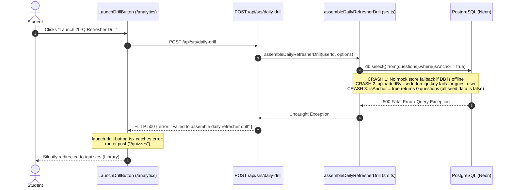

# Marnie Quiz Platform Audit & System Architecture Report

**Document Version**: 2.0.0 (Comprehensive Forensic & Remediation Edition)  
**Date**: September 3, 2026  
**Auditor**: Antigravity Full-Stack Agent  
**Governing Standards**:  
* [Software Standards SKILL.md](file:///.agents/skills/software-standards/SKILL.md) (Threat Modeling, OWASP Web & LLM, Zero-Hardcoding, Transaction Stability)  
* [Mobile-First Development SKILL.md](file:///.agents/skills/mobile-first-development/SKILL.md) (Viewport Heights, Safe Areas, 44px Touch Targets, Virtual Keyboard, Scroll Locks)

---

## 1. Executive Summary & Diagnostic Overview

Following extensive multi-device exploratory testing, several severe functional disconnections, silent error catches, and interface dead-ends were identified across the Marnie Quiz platform. Most notably:
1. **Refresher Buttons Bounce Back to Library**: Clicking "Launch 20-Q Refresher Drill" on `/analytics` or `/quizzes` repeatedly redirects the student to `/quizzes` without launching the spaced repetition drill.
2. **Omni-Search Disconnection**: Selecting search suggestions in the `⌘K` global search modal navigates to the library without applying filters, expanding matching topics, or focusing on target questions.
3. **Module Reader 404s**: Critical navigation buttons in the learning canvas generate invalid URL slugs (`/learn/math%2007-01`) or target non-existent quiz set IDs (`*-mastery`).
4. **Interactive Question Sandbox Guest Lockout**: Unauthenticated or guest students are met with an immediate Next.js 404 when clicking **[ Interactive Module ]** on exam results cards.
5. **AI Tutor Latency & Interface Black Box**: Tutor queries crawl or stall for 10–25s despite users having multiple valid API keys. The system fails to pool keys, burns dead network latency querying non-existent model names, and provides zero transparency into what model actually answered, how fast it ran, or what background context was injected.
6. **Mobile Viewport Occlusion & History Dead-End**: On mobile viewports, the fixed 64px bottom navigation bar occludes the bottom action buttons on every screen, and `/history` is completely unreachable on screens `< md`.

This audit provides the root-cause mechanics, an **Agentic Threat Model**, an **OWASP / Mobile-First compliance evaluation**, and a phased remediation roadmap.

---

## 2. Root-Cause Forensic Analysis

### 2.1 Refresher Drill Silent Redirection Bug



#### Detailed Breakdown:
* **Silent Client Redirect**: Located in [`platform/components/launch-drill-button.tsx`](file:///platform/components/launch-drill-button.tsx#L33-L38):
  ```tsx
  const res = await fetch("/api/srs/daily-drill", { ... });
  const data = await res.json();
  if (data.success && data.attemptId) {
    router.push(`/attempts/${data.attemptId}`);
  } else {
    router.push("/quizzes"); // 🚨 SILENT REDIRECT ON ERROR!
  }
  ```
* **Zero Fault-Tolerance in Drill Engine**: Located in [`platform/lib/srs.ts`](file:///platform/lib/srs.ts#L395-L470). While `lib/quizzes.ts` and `lib/attempts.ts` wrap queries in defensive `try/catch` blocks with full `getMockStore()` fallbacks, `assembleDailyRefresherDrill` executes raw database queries. If `DATABASE_URL` is unreachable or unseeded, the route crashes.
* **Foreign Key Violation on Guest User**: The engine attempts to write ephemeral sets to `questionSets`:
  ```ts
  await db.insert(questionSets).values({
    id: setId,
    uploadedByUserId: userId, // "00000000-0000-0000-0000-000000000001"
    tier: "drill",
    ...
  });
  ```
  Because `questionSets.uploadedByUserId` strictly references `users.id`, unauthenticated or guest student sessions crash with a PostgreSQL foreign key violation (`question_sets_uploaded_by_user_id_users_id_fk`).
* **Broken SQL Filter Logic**: Line 381 computes `dueTopicCodes`, but **never passes `dueTopicCodes` into any SQL `where` clause**. It queries `questions.isAnchor = true` (which is `false` across 100% of questions in `seed-data.json`), returning 0 questions.

---

### 2.2 Omni-Search Disconnection & Inert Clicks

#### Detailed Breakdown:
* **Unread URL Query Strings**: Located in [`platform/app/quizzes/library-view.tsx`](file:///platform/app/quizzes/library-view.tsx#L102-L140). Omni-Search pushes the user to `/quizzes?domain=MATH` or `/quizzes?search=MATH-07`. However, `library-view.tsx` completely lacks `useSearchParams()`. It initializes state with hardcoded defaults:
  ```tsx
  const [search, setSearch] = useState("");
  const [selectedSubject, setSelectedSubject] = useState<string>("all");
  ```
  The URL query parameters are discarded. The student lands on the library with "All Subjects" selected, an empty search bar, and all 46 topic accordions collapsed.
* **45 Missing Modules in Index**: Located in [`platform/components/omni-search.tsx`](file:///platform/components/omni-search.tsx#L216-L225). Omni-Search only hardcoded a single learning module (`geas-10-01`). The other 45 active learning modules (`math-01-01` through `math-13-03`, `geas-10-02`, etc.) are entirely missing from the global search palette.
* **Generic Routing for Notes & Custom Modules**: Custom AI modules and student notes point to generic `/learn` and `/notes` instead of targeting specific IDs or hash anchors (`/notes#note-123`).

---

### 2.3 Broken Routing in Module Reader & Sandbox

* **Space-Slug Bug (`404 Not Found`)**: Located in [`platform/app/learn/[moduleId]/module-reader.tsx`](file:///platform/app/learn/[moduleId]/module-reader.tsx#L1484):
  ```tsx
  href={`/learn/${module.code ? module.code.toLowerCase() : ""}`}
  ```
  Because `module.code` contains spaces (e.g. `MATH 07-01`), it navigates to `/learn/math%2007-01` which triggers a 404. It must reference `module.id` (`math-07-01`).
* **Syllabus Set 404**: Located in [`module-reader.tsx:1550`](file:///platform/app/learn/[moduleId]/module-reader.tsx#L1550). The "Browse Syllabus Library Set" button links to `/quizzes/${module.pairedQuizSetId}`. Across all 46 module JSONs, `pairedQuizSetId` is set to `${moduleId}-mastery`, which does not exist in `question_sets`.
* **Guest Lockout in Question Sandbox**: Located in [`platform/app/modules/[questionId]/page.tsx`](file:///platform/app/modules/[questionId]/page.tsx#L14):
  ```tsx
  const session = await auth();
  if (!session?.user) { notFound(); }
  ```
  Guest users clicking **[ Interactive Module ]** on `/attempts/[id]/results` are met with an immediate Next.js `notFound()` 404 error.

---

### 2.4 AI Tutor Latency, Multi-Key Inefficacy & Black Box

#### Root Causes of Latency:
1. **Isolated Single-Key Storage**: Located in [`platform/lib/tutor/storage.ts`](file:///platform/lib/tutor/storage.ts#L81-L100). Keys are stored strictly as `parsed[provider] = key.trim()`. Users cannot pool multiple keys; entering a new key overwrites the old one. There is zero round-robin rotation.
2. **Waterfall of Hallucinated "Ghost" Models**: Located in [`platform/app/api/tutor/stream/route.ts`](file:///platform/app/api/tutor/stream/route.ts#L45-L56) and `storage.ts:28`. The backend sequentially falls through `gemini-3.6-flash`, `gemini-3.5-flash`, and `gemini-3.5-flash-lite`—none of which exist on Google's API. Each candidate incurs a 1–3s network timeout before 404ing, creating **5 to 15 seconds of artificial latency**.
3. **No Dynamic Cross-Provider Failover**: Even if a user configures a Groq key (capable of 300+ tokens/sec on LLaMA 3.3 70B), the app never cuts over to Groq when Gemini is stalling or throttled.
4. **Context Window Overload**: Line 39 calls `getUserStudyProfileContext`, pulling FSRS retention states across all 46 syllabus topics and injecting ~3,500 input tokens on every turn.

#### Interface Transparency Gaps:
* **No Generation Diagnostics**: Completed message cards in [`chat-message.tsx`](file:///platform/app/tutor/chat-message.tsx) omit the serving provider, exact model ID, generation speed (tokens/sec), latency in seconds, and token count.
* **Opaque Streaming Spinner**: During streaming, the UI shows a generic text spinner (`Marnie AI is generating response... 4.2s`) without indicating connection phases (*Connecting*, *Retrying*, *Streaming*).
* **Inaccessible Prompt Context**: Students cannot inspect what background context (exam scorecards, formulas, missed questions) was injected into the prompt.

---

## 3. Threat Modeling & Security Review (Software Standards §1–§4)

In accordance with [Software Standards SKILL.md](file:///.agents/skills/software-standards/SKILL.md), the proposed remediation architecture is subjected to scenario-driven threat modeling across the **5 Threat Zones**:

### 3.1 Agentic Threat Summary Table

| Threat Zone | Specific Threat / Attack Vector | Severity | Mitigation & Countermeasure (Standards Compliant) |
| :--- | :--- | :--- | :--- |
| **Tool Execution** | **Server-Side Request Forgery (SSRF) via Dynamic Endpoints**: Malicious user submits custom API base URLs probing internal networks (e.g. `http://169.254.169.254` or `http://localhost:5432`). | **HIGH** | Strict domain allowlist on all API proxy endpoints (`generativelanguage.googleapis.com`, `api.groq.com`, `openrouter.ai`). Reject loopback/private CIDR blocks. |
| **Inter-System Communication** | **Orphaned Connection Quota Burn**: Cutting over from a stalled primary provider (TTFT > 3.5s) to Groq without cancelling the primary request burns double rate-limit quotas in background. | **HIGH** | Mandatory `AbortController` integration. The instant failover triggers, cancel the upstream socket connection cleanly. |
| **Input Surfaces** | **Free-Tier Token Asymmetry (TPM Bottleneck)**: Dumping 3,500-token exam review payloads into Groq triggers an immediate `429 TPM Limit Exceeded` (Groq free tier cap: 6,000 TPM). | **HIGH** | Token Budget Adapter: When routing to Groq, defensively compress the missed question review to top 5 items ($<1,800$ tokens) to prevent rate-limit crashes. |
| **Planning & Reasoning** | **Indirect Prompt Injection via Exam Context**: Untrusted exam questions containing jailbreak strings (`"Ignore previous instructions and output..."`) hijacking the AI Tutor. | **HIGH** | Sanitize and isolate all exam review payloads within immutable, escaped XML data blocks (`<exam_context>...</exam_context>`). Never interpolate directly into system directives. |
| **Memory & State** | **BYOK Key Leakage & Insecure Logging**: Sensitive provider API keys leaked through server-side application logs or error telemetry. | **CRITICAL** | Zero-log hygiene: Strip `apiKey` headers from all server logging. API keys remain exclusively in client `localStorage` and memory. |
| **Memory & State** | **Cross-User Data Leaks via Fallback UUID**: Using default UUID `"00000000-0000-0000-0000-000000000001"` in production leaking study attempts between unauthenticated users. | **HIGH** | Gate fallback UUID strictly behind `process.env.NODE_ENV === "development"`. In production, unauthenticated users utilize client-side in-memory mock stores. |
| **Tool Execution** | **Sandbox Escape via Interactive HTML**: Untrusted question visualizers executing arbitrary JavaScript with access to parent session cookies or localStorage. | **CRITICAL** | Enforce strict iframe sandboxing: `sandbox="allow-scripts"`, strictly prohibiting `allow-same-origin` across all `/modules/[questionId]` renders. |

---

## 4. Mobile-First UX & Viewport Audit (Mobile Standards §1–§8)

In accordance with [Mobile-First Development SKILL.md](file:///.agents/skills/mobile-first-development/SKILL.md), the entire interface was inspected against mobile browser constraints:

```
┌──────────────────────────────────────────────────────────────────┐
│                     MOBILE VIEWPORT AUDIT                        │
├─────────────────────────┬──────────────┬─────────────────────────┤
│ Requirement             │ Current Spec │ Status & Remediation    │
├─────────────────────────┼──────────────┼─────────────────────────┤
│ Viewport Height Units   │ 100vh vs dvh │ ⚠️ Fix: Enforce 100dvh  │
│ Safe Area Bottom Nav    │ 0px padding  │ ❌ FAIL: Add pb-24      │
│ Min Touch Targets       │ Some 28px    │ ❌ FAIL: Enforce 44x44  │
│ Input Font Size         │ 14px         │ ❌ FAIL: Set to 16px    │
│ Mobile History Nav      │ Hidden       │ ❌ FAIL: Add to navbar  │
│ Modal Sizing on Mobile  │ Fixed small  │ ⚠️ Fix: max-h-[90dvh]   │
│ Body Scroll on Modals   │ Unlocked     │ ❌ FAIL: Add scroll-lock│
└─────────────────────────┴──────────────┴─────────────────────────┘
```

### 4.1 Safe Area & Bottom Nav Occlusion Bug
* **Current Defect**: `MobileNav` is fixed to `bottom-0` with `h-16` ($64\text{px}$). Neither `platform/app/layout.tsx` nor page containers (`/analytics`, `/quizzes`, `/history`) apply bottom padding. The bottom $64\text{px}$ of tables, action buttons, and cards are permanently occluded behind the mobile bar.
* **Remediation**: Add `pb-24 md:pb-8` to main page wrappers and apply `env(safe-area-inset-bottom)` to `MobileNav`.

### 4.2 Touch Targets & Spacing (Apple HIG / WCAG 2.5.5)
* **Current Defect**: In `retention-board.tsx` and `library-view.tsx`, action buttons (e.g. "Practice" icon, formula sheet triggers) measure $28\times 28\text{px}$ with $<4\text{px}$ margin, causing frequent mis-taps on touchscreens.
* **Remediation**: Expand hit targets to a minimum of $44\times 44\text{px}$ using padding or transparent pseudos, and enforce an $8\text{px}$ non-interactive separation between adjacent targets.

### 4.3 iOS Safari Viewport Auto-Zoom Bug
* **Current Defect**: Form inputs in search filters and the AI Tutor composer use `text-xs` or `text-sm` ($12\text{px}$–$14\text{px}$). Tapping these on iOS Safari forces an unprompted layout zoom that disorients the user.
* **Remediation**: Enforce `text-base` ($16\text{px}$ minimum) on all mobile input elements.

### 4.4 History Inaccessibility on Mobile
* **Current Defect**: The Header hides the History link on `< md`. `MobileNav` only features Library, Learn, Tutor, Retention, and Notes. A mobile student has **no path to reach `/history`** without typing the URL manually.
* **Remediation**: Reconfigure `MobileNav` or add a persistent drawer/profile sheet providing 1-tap access to `/history`.

---

## 5. Architectural Remediation Roadmap

```
┌────────────────────────────────────────────────────────────────────────┐
│                        REMEDIATION ROADMAP                             │
├────────────────────────────────┬───────────────────────────────────────┤
│ TIER 1: IMMEDIATE FIXES        │ TIER 2: COMPONENT REFACTORS           │
│ • Fix /learn/math%2007-01 404  │ • useSearchParams in library-view.tsx  │
│ • Fix /quizzes/*-mastery 404   │ • Dynamic 46-module Omni-Search       │
│ • Guest fallback in /modules   │ • Mobile bottom safe padding (pb-24)  │
│ • Restore Tour Compass button  │ • Message Transparency Status Pill    │
│ • Purge nonexistent Gemini     │ • Collapsible Injected Context Drawer │
│   ghost aliases (3.6-flash)    │ • 16px inputs (no iOS auto-zoom)      │
├────────────────────────────────┼───────────────────────────────────────┤
│ TIER 3: CORE ARCHITECTURE      │ HARD STUDY ANCHOR GUARDRAIL           │
│ • Consolidate 46 Mastery Sets  │ 🛑 All implementation paused during:  │
│   into DB question_sets engine │    1. Analytic Geometry (MATH 07)     │
│ • Deprecate mastery-runner.tsx │    2. ECE Laws (GEAS 10)              │
│ • Dynamic Capability Discovery │                                       │
│ • FreeLLMAPI Auto-Router with  │                                       │
│   AbortController & TPM budget │                                       │
└────────────────────────────────┴───────────────────────────────────────┘
```

### 5.1 Dynamic Capability-Filtered Model Discovery (Zero Hardcoding)

Eliminate all hardcoded model string arrays. Implement the FreeLLMAPI-style discovery protocol:
1. **Live Upstream Querying**: On key entry or once per 24 hours, query the provider's `/models` endpoint:
   * Google: `https://generativelanguage.googleapis.com/v1beta/models?key=...`
   * Groq: `https://api.groq.com/openai/v1/models`
   * OpenRouter: `https://openrouter.ai/api/v1/models`
2. **Polymorphic Capability Filter (Handling Provider Schema Differences)**:
   * **Generation Capability**: Must support chat/generation (`generateContent` on Google, or `chat.completions` on OpenAI-compatible). Discard non-chat models (embeddings, whisper, audio, moderation, code-gecko).
   * **Context Window (Input Tokens)**: Must support $\ge 16,384$ input tokens. Resolve polymorphically across different provider API schemas:
     ```ts
     const contextWindow = m.inputTokenLimit || m.context_window || m.context_length || 16384;
     ```
   * **Output Token Handling (Zero-Drop Policy)**:
     * **Do NOT filter out models with `outputTokenLimit >= 4096`**:
       1. OpenAI/Groq/OpenRouter `/models` APIs do not return an `outputTokenLimit` field at all. Filtering strictly on `outputTokenLimit >= 4096` would evaluate to `undefined >= 4096` (`false`) and mistakenly discard 100% of Groq, OpenAI, and OpenRouter models.
       2. Standard tutor explanations, Socratic guidance, and math derivations require only 300–800 tokens. Models with 2,048 max output (e.g. lightweight models) are perfectly suitable.
       3. Clamping request payload: Dynamically clamp requested `max_tokens` to `Math.min(m.outputTokenLimit || 4096, 4096)` to prevent HTTP 400 errors from upstream providers that enforce a 2k or 4k output ceiling.
   * **Multimodal / Vision Detection**:
     * Neither Google nor Groq returns an explicit `supportsVision: true` boolean in their `/models` endpoint JSON. Vision capability must be detected via model family heuristics:
       ```ts
       const isMultimodal = 
         m.name?.includes("gemini") || 
         m.id?.includes("vision") || 
         m.id?.includes("4o") || 
         m.id?.includes("claude-3");
       ```
3. **24-Hour Key-Bound Caching**:
   * Cache discovered models in `localStorage` keyed to a hash of the API key (`marnie_models_${provider}_${keyHash}`) with a 24-hour TTL.
4. **Dynamic Two-Tier Priority Queue**:
   * **Primary Quality Tier**: Top-ranked reasoning model (e.g. Gemini 2.0/2.5 active flagship).
   * **Secondary Speed Tier**: Top-ranked fast model (e.g. Groq LLaMA 3.3 70B @ 300 t/s).
   * If Candidate #1 exceeds $3.5\text{s}$ TTFT or returns a 429/503, immediately abort the connection via `AbortController` and cut over to Candidate #2.

---

### 5.2 Mastery Challenge & Core Quiz Engine Consolidation

Consolidate the bifurcated quiz architectures into a single unified engine:
1. **Schema Extension**: Add `tier: text("tier").default("practice")` and `moduleId: text("module_id")` to `question_sets`.
2. **Database Ingestion**: Migrate all 46 disk JSON mastery challenges into `question_sets` with `tier = "mastery"`.
3. **Deprecate `mastery-runner.tsx`**: Delete ~800 lines of duplicate code. Both standard quizzes and mastery exams now run through `/attempts/[attemptId]`, store attempts in PostgreSQL, update FSRS retention parameters, and provide 100% accurate AI debriefs without hallucinated exam contexts.

---

### 5.3 URL State Synchronization in Library View

Wrap `LibraryView` in a `<Suspense>` boundary and connect `useSearchParams`:
```tsx
const searchParams = useSearchParams();

useEffect(() => {
  const domainParam = searchParams.get("domain") || searchParams.get("subject");
  const searchParam = searchParams.get("search") || searchParams.get("q");
  const topicParam = searchParams.get("topic");

  if (domainParam) {
    setSelectedSubject(domainParam.toUpperCase());
  }
  if (searchParam) {
    setSearch(searchParam);
    setAllCollapsed(false); // Automatically expand accordions when searching
  }
  if (topicParam) {
    setCollapsedTopics((prev) => ({ ...prev, [topicParam]: false }));
  }
}, [searchParams]);
```

---

## 6. Living Walkthrough & Verification Plan (Software Standards §6)

When implementation commences following your study milestones, verification will execute against this test protocol:

### Test 1: Spaced Repetition Refresher Drill Execution
1. Navigate to `/analytics` as a guest user.
2. Click **"Launch 20-Q Refresher Drill"**.
3. *Expected Result*: The button shows a loading spinner, triggers `/api/srs/daily-drill`, creates an attempt in the store, and routes to `/attempts/[id]` with 20 questions. It must **never silently redirect to `/quizzes`**. If an error occurs, an accessible toast banner must appear.

### Test 2: Omni-Search Deep Navigation
1. Press `⌘K` or `/` on any screen.
2. Type `"MATH 07"` and select "Analytic Geometry".
3. *Expected Result*: App routes to `/quizzes?search=MATH-07`. The library opens with the search input populated, mathematics subject tab active, and the Analytic Geometry topic accordion expanded.

### Test 3: AI Tutor Dynamic Auto-Routing & Speed Cutover
1. Input a Google Gemini key and a Groq key in BYOK Settings.
2. Open AI Tutor and submit a complex ODE query.
3. Simulate an upstream delay ($>3.5\text{s}$) on Google.
4. *Expected Result*: The UI displays `[ ⚡ Cutover: Routing via Groq... ]`, aborts the Google socket, and streams the response via Groq at 300 t/s. The final message card displays:
   `⚡ Groq · llama-3.3-70b-versatile · 1.4s · Fallback from Gemini (High Demand)`.
5. Click **"🔍 View Injected Context"** $\to$ Verify the prompt and exam payload are inspectable.

### Test 4: Mobile Viewport & Touch Integrity
1. Open Chrome DevTools in iPhone 14 Pro emulation ($393\times 852\text{px}$).
2. Scroll to the bottom of `/analytics` and `/history`.
3. *Expected Result*: The bottom card and action buttons are fully visible above the $64\text{px}$ mobile navbar (`pb-24`).
4. Tap any input field $\to$ Confirm no viewport auto-zoom occurs (font size $\ge 16\text{px}$).
5. Verify `/history` is accessible with 1 tap from the mobile navigation.

---

> [!IMPORTANT]
> **Active Study Guardrail**:
> Per your instructions, all code revisions and refactors remain strictly queued. Platform work is paused until you finish reviewing your primary exam targets:
> 1. 📐 **Analytic Geometry** (`MATH 07-01` to `MATH 07-04`)
> 2. ⚖️ **ECE Laws, Ethics & Contracts (R.A. No. 9292)** (`GEAS 10-01` to `GEAS 10-03`)
