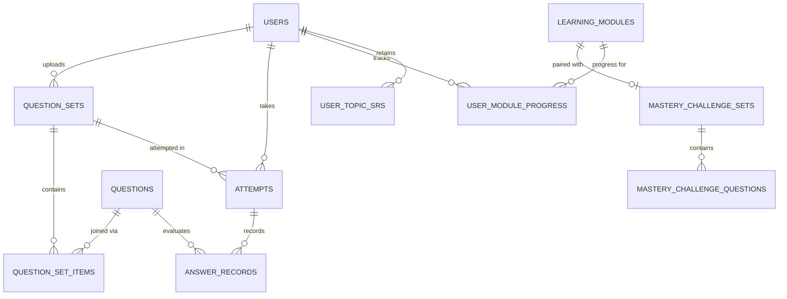

# Marnie Quiz: Platform Data Objects & Schema Reference

This document serves as the authoritative specification for all data objects, entities, and schemas across the **Marnie Quiz** board exam platform. It details both the persistent PostgreSQL (Drizzle ORM) database entities and the decoupled static/JSON learning assets.

---

## 1. High-Level Entity Map



---

## 2. Core Objects & Schemas

### A. Learning Module (`LearningModule`)
* **Storage**: Static JSON on disk (`test-sets/learning-modules/{domain}/{moduleId}.json`).
* **Purpose**: Rich interactive review textbook module containing theory, formulas, comparison tables, interactive visualizers, and multiple-choice concept checks.

```typescript
export interface LearningModule {
  id: string;                                    // e.g. "math-07-01", "geas-10-01"
  code: string;                                  // e.g. "MATH 12-01", "GEAS 10-01"
  domain: "MATH" | "ELECS" | "GEAS" | "EST";     // One of the 4 PRC board exam subjects
  topicCode: string;                             // e.g. "MATH-07", "GEAS-10"
  topicTitle: string;                            // e.g. "Analytic Geometry", "ECE Law"
  subtopicTitle: string;                         // e.g. "Cartesian Coordinate System"
  order: number;                                 // Sequence within topic (1, 2, 3...)
  pairedQuizSetId?: string;                      // Optional legacy question set ID

  // Navigation & Bridges
  toc: Array<{ id: string; title: string; level: number }>;
  prerequisiteBridge?: { priorModuleId?: string; text: string };
  crossSubjectBridges: Array<{
    targetDomain: "MATH" | "ELECS" | "GEAS" | "EST";
    targetTopicCode: string;
    badgeText: string;
    description: string;
    practicalExample: string;
  }>;

  // Pedagogical Content
  terms: Array<{ term: string; definition: string; boardRelevance?: string }>;
  formulas: Array<{ title: string; formula: string; note?: string }>;
  comparisonTables?: Array<{ id: string; title: string; headers: string[]; rows: string[][] }>;
  writtenChallenges?: Array<{ id: string; prompt: string; modelAnswer: string; keyCheckpoints: string[] }>;

  theory: {
    mentalAnchor: string;
    contentMarkdown: string;
  };

  declarativeVisualizer?: {
    archetype: string;
    title: string;
    description: string;
    config: {
      controls: Array<{ id: string; label: string; min: number; max: number; step: number; defaultValue: number; unit?: string }>;
      initialParams?: Record<string, any>;
      data?: Record<string, any>;
    };
  };

  conceptChecks: Array<{
    id: string;
    prompt: string;
    options: { A: string; B: string; C: string; D: string };
    correctAnswer: "A" | "B" | "C" | "D";
    explanation: string;
  }>;

  examples: Array<{
    title: string;
    problem: string;
    stepByStepSolution: string[];
    finalAnswer: string;
    calculatorTechnique?: string;
  }>;

  masteryChallenge?: MasteryChallengeSet;
}
```

---

### B. Mastery Challenge Set & Questions (`MasteryChallengeSet`, `MasteryChallengeQuestion`)
* **Storage**: Static JSON on disk (`test-sets/learning-modules/{domain}/mastery/{moduleId}-mastery.json`).
* **Purpose**: Decoupled, companion 20–25 question exam set that tests exam retention, cognitive archetypes, calculator bypasses, and feeds into the FSRS memory engine.

```typescript
export interface MasteryChallengeSet {
  moduleId: string;                              // e.g. "geas-10-01"
  moduleCode: string;                            // e.g. "GEAS 10-01"
  title: string;                                 // e.g. "GEAS 10-01 Mastery Challenge: Legislative Origins"
  description: string;
  totalQuestions: number;                        // Typically 20–25 questions
  timeLimitMinutes: number;                      // 30–45 minutes
  questions: MasteryChallengeQuestion[];
}

export interface MasteryChallengeQuestion {
  id: string;                                    // e.g. "q-geas10-01-01"
  promptText: string;                            // Markdown & LaTeX enabled
  choiceA: string;
  choiceB: string;
  choiceC: string;
  choiceD: string;
  correctChoice: "A" | "B" | "C" | "D";
  explanation: string;                           // Crisp solution with statutory/formula citation
  imageUrl?: string;                             // Optional diagram URL
  archetype?: CognitiveArchetype;                // Explicit cognitive archetype
  isAnchor?: boolean;                            // High-yield core benchmark question
  category?: string;
  difficulty?: "easy" | "medium" | "hard";
}
```

#### Canonical Cognitive Archetypes:
1. **`conceptual`** (or `statutory`): Theoretical definitions, physical principles, article/section definitions, invariant properties without computation.
2. **`numerical`** (or `threshold`): Direct numerical evaluation, statutory fines, penalty thresholds, enactment dates, standard threshold recall.
3. **`standard`** (or `classification`): Formulaic execution, classification of PECE vs ECE vs ECT, standard multi-step textbook procedures.
4. **`applied`** (or `scenario`): Real-world engineering scenarios, circuit fault analysis, ethical violations, engineering economics decisions.
5. **`trap`**: Counter-intuitive options, phrasing traps ("shall" vs "may", "which is NOT required"), sign inversion distractors.
6. **`shortcut`**: 5-second inspection tricks, calculator mode shortcuts (e.g. `Pol(`, complex mode, table mode).

---

### C. Question Set (`QuestionSet`)
* **Storage**: PostgreSQL table `question_sets` (or memory store fallback).
* **Purpose**: Primary container for test sets, CSV uploads, drills, and auto-generated mastery quiz sets.

```typescript
export interface QuestionSet {
  id: string;                                    // UUID or custom slug (e.g. "math-07-01-mastery")
  uploadedByUserId: string;                      // References User ID
  folderId: string | null;                       // Optional organizational folder
  title: string;                                 // Exam title
  tier: "diagnostic" | "review" | "drill" | "simulation" | "conceptual_drill" | "mastery";
  topicCode: string | null;                      // e.g. "MATH-07", "GEAS-10"
  subjectTag: string | null;                     // e.g. "MATH", "ELECS", "GEAS", "EST"
  moduleId: string | null;                       // Foreign link to learning module (e.g. "math-07-01")
  visibility: "shared" | "private";              // Shared by default
  rawCsv: string | null;                         // Original uploaded CSV text
  createdAt: Date;
  updatedAt: Date;
}
```

---

### D. Question (`Question`) & Question Set Item (`QuestionSetItem`)
* **Storage**: PostgreSQL tables `questions` and `question_set_items` (Many-to-Many join).
* **Purpose**: Normalized question bank items that can be reused across diagnostic, refresher, simulation, or mastery test sets.

```typescript
export interface Question {
  id: string;                                    // UUID
  sourceQuestionSetId: string | null;            // Originating set
  promptText: string;                            // KaTeX enabled markdown
  choiceA: string;
  choiceB: string;
  choiceC: string;
  choiceD: string;
  correctChoice: "a" | "b" | "c" | "d";         // Normalized lowercase
  explanation: string | null;
  imageUrl: string | null;
  interactiveHtml: string | null;                // Sandboxed iframe simulation payload
  interactiveUrl: string | null;
  microCluster: string | null;                   // Subtopic identifier for SRS retrieval
  archetype: string | null;                      // Cognitive archetype tag
  isAnchor: boolean | null;                      // True for essential benchmark questions
  createdAt: Date;
}

export interface QuestionSetItem {
  id: string;                                    // UUID
  questionSetId: string;
  questionId: string;
  orderIndex: number;                            // 0-indexed question ordering
}
```

---

### E. Quiz Attempt (`Attempt`) & Answer Record (`AnswerRecord`)
* **Storage**: PostgreSQL tables `attempts` and `answer_records`.
* **Purpose**: Represents an active or completed exam sitting with server-side graded answer choices and latency telemetry.

```typescript
export interface Attempt {
  id: string;                                    // UUID
  userId: string;
  questionSetId: string;
  mode: "untimed" | "timed_per_question" | "timed_whole_exam";
  startedAt: Date;
  clientCreatedAt?: Date;
  completedAt: Date | null;
  durationSeconds: number | null;
  score: number | null;                          // Correct count
  totalQuestions: number;
}

export interface AnswerRecord {
  id: string;                                    // UUID
  attemptId: string;
  questionId: string;
  selectedChoice: "a" | "b" | "c" | "d" | null;  // Null if skipped
  isCorrect: boolean;
  timeSpentSeconds: number | null;
}
```

---

### F. Spaced Repetition Engine: Topic & Module Records (`UserTopicSrs`, `UserModuleProgress`)
* **Storage**: PostgreSQL tables `user_topic_srs` and `user_module_progress`.
* **Purpose**: Free Spaced Repetition Schedule (FSRS) memory tracking calculating stability ($S$), retrievability ($R$), and review due dates.

```typescript
export interface UserTopicSrs {
  id: string;                                    // UUID
  userId: string;
  topicCode: string;                             // e.g. "MATH-07"
  topicName: string;
  domain: string;                                // "MATH" | "ELECS" | "GEAS" | "EST"
  stabilityDays: number;                         // FSRS Memory stability
  retrievability: number;                        // Current recall probability (0.0 to 1.0)
  difficulty: number;                            // 1.0 to 10.0 scale
  lastStudiedAt: Date | null;
  nextReviewDue: Date | null;
  totalReviews: number;
  reps: number;
  lapses: number;
}

export interface UserModuleProgress {
  id: string;                                    // UUID
  userId: string;
  moduleId: string;                              // e.g. "geas-10-01"
  topicCode: string;                             // e.g. "GEAS-10"
  domain: string;                                // e.g. "GEAS"
  isCompleted: boolean;                          // Mastery score >= 70%
  isBookmarked: boolean;
  conceptChecksCompleted: number;
  conceptChecksTotal: number;
  conceptChecksAccuracy: number;                 // 0.0 to 1.0
  masteryScorePercent: number | null;            // 0 to 100
  confidence: "weak" | "moderate" | "confident" | "mastered" | null;
  stabilityDays: number;
  retrievability: number;
  lastStudiedAt: Date;
  nextReviewDue: Date;
  totalReviews: number;
  createdAt: Date;
  updatedAt: Date;
}
```

---

### G. AI Tutor Session & Diagnostics (`ChatSession`, `ChatMessage`, `MessageDiagnostics`)
* **Storage**: Browser LocalStorage & live HTTP streaming headers.
* **Purpose**: Socratic tutor interaction history with full transparency telemetry from the FreeLLMAPI auto-router.

```typescript
export interface MessageDiagnostics {
  provider: "gemini" | "groq" | "openai" | "anthropic" | "openrouter" | "deepseek";
  model: string;                                 // e.g. "gemini-2.0-flash", "llama-3.3-70b-versatile"
  latencySeconds: number;                        // Time-to-first-token or duration in seconds
  tokensPerSec?: number;                         // Throughput
  cutover?: boolean;                             // True if auto-failed over from Gemini to Groq
  injectedContext?: any;                         // Verbatim scorecard/syllabus payload inspected by user
}

export interface ChatMessage {
  id: string;
  role: "user" | "assistant";
  content: string;
  timestamp: number;
  functionMode?: "chat" | "review_exam" | "custom_module" | "tricky_questions" | "formula_sheet";
  diagnostics?: MessageDiagnostics;
}

export interface ChatSession {
  id: string;
  title: string;
  messages: ChatMessage[];
  createdAt: number;
  updatedAt: number;
}
```
