# Step 5: Cross-Subject Master Linkage & Learning Architecture Audit

> **Philippine ECE Licensure Examination • 4-Subject Holistic Synthesis**
> Single Source of Truth for all Prerequisite Chains, Cross-Subject Conceptual Bridges, Calculator Keystroke Standards, and Visualizer Mapping.
> Formatted according to the `learning-module-authoring` skill standards.

---

## 1. Executive Summary & Curriculum Cohesion

The 4 board exam subjects are not isolated silos. They form a **compounding, interconnected engineering pyramid**:

```mermaid
graph TD
    subgraph Foundation [Level 1: Mathematics - 20%]
        M1[MATH 01: Algebra & Logs]
        M5[MATH 05: Trig & Phasors]
        M9[MATH 09: Conics & Vectors]
        M10[MATH 10/11: Calculus]
        M12[MATH 12: Differential Equations]
        M13[MATH 13: Complex & Matrices]
    end

    subgraph AppliedSciences [Level 2: GEAS - 20%]
        G2[GEAS 02: Mechanics & Vectors]
        G3[GEAS 03: Waves & Optics]
        G5[GEAS 05: Thermodynamics]
        G6[GEAS 06: Engineering Economics]
        G7[GEAS 07: Electromagnetics]
    end

    subgraph CoreElectronics [Level 3: Elecs - 30%]
        E1[ELEC 01: Fields & Charge]
        E3[ELEC 03: DC Circuit Theorems]
        E4[ELEC 04: AC Phasors & Power]
        E5[ELEC 05: Transients & Resonance]
        E7[ELEC 07/08: BJT & MOSFETs]
        E9[ELEC 09: Op-Amps]
        E15[ELEC 15: Digital Logic]
    end

    subgraph SystemsTech [Level 4: EST - 30%]
        S1[EST 01: Noise & Shannon Link]
        S2[EST 02: Radiowave Propagation]
        S3[EST 03: Analog Modulation]
        S4[EST 04: Transmission Lines]
        S5[EST 05: Antennas & Radiation]
        S7[EST 07: Optical Fiber]
        S9[EST 09: Digital Modulation]
        S10[EST 10: Networking]
    end

    %% Key Cross-Subject Links
    M1 -->|Decibels dB = 10log| S1
    M1 -->|Progressions & Interest| G6
    M5 -->|Phasor R+jX| E4
    M5 -->|Spherical Trig| S2
    M9 -->|Parabolic Geometry| S5
    M9 -->|Snell Optics| G3
    M10 -->|Rate of Change| G2
    M10 -->|Definite Integrals| E4
    M12 -->|Exponential e^-t/tau| E5
    M12 -->|Laplace s-plane| E9
    M13 -->|Vector Cross AxB| G7
    M13 -->|Complex Matrix| E3

    G7 -->|Maxwell Waves| S2
    G7 -->|Poynting Vector| S5
    G3 -->|Snell & TIR| S7
    E4 -->|Complex Impedance| S4
    E5 -->|Resonance Q-factor| S3
    E15 -->|Binary Framing| S10
    M13 -->|QAM Constellations| S9
```

---

## 2. Comprehensive Cross-Subject Conceptual Bridge Matrix

The following matrix documents the exact mathematical/physical models shared across subjects:

| Core Mathematical / Physical Model | Primary Origin Subject | Re-emergence in ELECS | Re-emergence in GEAS | Re-emergence in EST |
| :--- | :--- | :--- | :--- | :--- |
| **Logarithms & Powers of 10** | `MATH 01` (Algebra) | `ELEC 14` (Bode plots, $-20	ext{dB/dec}$) | `GEAS 03` (Sound intensity $	ext{dB}$) | `EST 01` (Friis equation, $dBm, dBW, dBu$) |
| **Complex Numbers & Phasors** | `MATH 05` & `MATH 13` | `ELEC 04` ($Z = R + jX, S = P + jQ$) | `GEAS 07` (Time-harmonic EM fields) | `EST 04` (Smith Chart reflection $\Gamma$), `EST 09` (QAM) |
| **Conic Sections (Parabolas/Hyperbolas)** | `MATH 09` (Conics) | — | `GEAS 03` (Parabolic/hyperbolic mirrors) | `EST 05` (Parabolic dishes, Cassegrain feeds) |
| **1st-Order Differential Equations** | `MATH 12` (DE) | `ELEC 05` (RC/RL transients $	au = RC, L/R$) | `GEAS 01` (Radioactive decay half-life) | `EST 02` (Atmospheric absorption decay) |
| **2nd-Order Characteristic Equations** | `MATH 01` & `MATH 12` | `ELEC 05` (Underdamped, Critically, Overdamped) | `GEAS 02` (Damped harmonic oscillator) | `EST 03` (Second-order PLL loops) |
| **Vector Calculus ($
abla, 
abla\cdot, 
abla	imes$)** | `MATH 13` (Adv Math) | `ELEC 01` (Gauss Law flux $\oint \mathbf{E}\cdot d\mathbf{A}$) | `GEAS 07` (Maxwell's 4 equations) | `EST 05` (Poynting radiation vector $\mathbf{S} = \mathbf{E} 	imes \mathbf{H}$) |
| **Matrices & Linear Systems** | `MATH 13` (Adv Math) | `ELEC 03` (Multi-mesh & Nodal matrix $[Y][V]=[I]$) | `GEAS 02` (3D structural truss equilibrium) | `EST 04` ($S$-parameters & $ABCD$ transmission matrices) |
| **Probability Distributions** | `MATH 02` (Probability) | `ELEC 13` (Measurement Gaussian error) | `GEAS 12` (Risk forecasting) | `EST 01` (Gaussian thermal noise), `EST 08` (Erlang B) |
| **Geometric Optics & Snell's Law** | `MATH 05` (Trig) | `ELEC 12` (Optoisolators & Photodiodes) | `GEAS 03` (Refraction & Critical angle) | `EST 07` (Fiber acceptance cone $NA = \sqrt{n_1^2 - n_2^2}$) |
| **Boolean Logic & Combinatorics** | `MATH 04` (Discrete) | `ELEC 15` (Karnaugh Maps & Gate synthesis) | `GEAS 10` (Bitwise operators in C/C++) | `EST 10` (CRC error checking & IP subnetting) |

---

## 3. Calculator Standard Verification (Karce KC-S991 & Canon F-789SGA)

All 4 syllabi enforce explicit keystrokes for allowed PRC non-programmable calculators:

### 1. Karce KC-S991 (Natural Display / V.P.A.M. Layout):
- **Equation Solver**: `<kbd>MODE</kbd> <kbd>5</kbd> <kbd>1</kbd>` ($2	imes 2$), `<kbd>MODE</kbd> <kbd>5</kbd> <kbd>2</kbd>` ($3	imes 3$), `<kbd>MODE</kbd> <kbd>5</kbd> <kbd>3</kbd>` (Quadratic), `<kbd>MODE</kbd> <kbd>5</kbd> <kbd>4</kbd>` (Cubic).
- **Complex Numbers**: `<kbd>MODE</kbd> <kbd>2</kbd>` $	o$ polar conversion via `<kbd>SHIFT</kbd> <kbd>2</kbd> <kbd>3</kbd>` ($rngle	heta$).
- **Reverse Option Testing**: `<kbd>MODE</kbd> <kbd>7</kbd>` (Table Mode) with custom start, end, and step intervals.
- **Calculus**: Numerical derivative `<kbd>SHIFT</kbd> <kbd>d/dx</kbd>` and numerical integral `<kbd>∫dx</kbd>`.
- **Statistics / Linear Regression**: `<kbd>MODE</kbd> <kbd>3</kbd> <kbd>2</kbd>` ($A+BX$).
- **Vectors / Matrices**: `<kbd>MODE</kbd> <kbd>6</kbd>` (Matrix) and `<kbd>MODE</kbd> <kbd>8</kbd>` (Vector).

### 2. Canon F-789SGA (605-Function Menu Layout):
- **Apps Button Menu**: `<kbd>APPS</kbd>` for fast access to Unit Conversions, Physical Constants, and Complex Conversions.
- **Equation Mode**: `<kbd>MODE</kbd> <kbd>EQN</kbd>` with 4-degree polynomial solving.
- **Matrix / Vector Operations**: `<kbd>MODE</kbd> <kbd>6</kbd>` (Matrix) and `<kbd>MODE</kbd> <kbd>8</kbd>` (Vector).

---

## 4. Visualizer Catalog Audit Across All 4 Syllabi

Every subject includes high-impact interactive visualizers fitting the 3 defined archetypes:

### 1. Morphological / Geometric Simulators:
- `MATH 09`: **Eccentricity Morphing Visualizer** ($e=0$ Circle $	o$ $0<e<1$ Ellipse $	o$ $e=1$ Parabola $	o$ $e>1$ Hyperbola).
- `MATH 05`: **Trigonometric Unit Circle & Phasor Angle Explorer**.
- `MATH 08/11`: **3D Solids of Revolution Slice Generator** (Pappus theorem).
- `GEAS 04`: **Mohr's Circle of Stress Interactive Transformer**.
- `EST 05`: **3D Antenna Radiation Pattern Visualizer** (Isotropic, Dipole, Parabolic).

### 2. Dynamic Parameter Sweepers:
- `ELEC 04`: **AC Power Triangle & Power Factor Correction Visualizer** ($P, Q_L, Q_C, S, 	ext{pf}$).
- `ELEC 05`: **RLC Transient Damping Waveform Generator** (Underdamped, Critically Damped, Overdamped).
- `ELEC 07`: **BJT DC Load Line & Q-Point Explorer** (Saturation $\leftrightarrow$ Cutoff).
- `GEAS 05`: **Carnot Cycle P-V & T-S Thermodynamic Loop Explorer**.
- `EST 01`: **Multi-Stage Friis Cascaded Noise Figure Simulator**.
- `EST 03`: **AM Time-Domain Envelope & FM Bessel Sideband Spectrum Visualizer**.
- `EST 09`: **Digital Constellation Jitter Explorer** (BPSK, QPSK, 16-QAM).

### 3. Step-by-Step Interactive Steppers:
- `MATH 01`: **Synthetic Division & Heaviside Partial Fraction Stepper**.
- `ELEC 03`: **Thévenin & Norton Source Conversion Step-by-Step Reduction**.
- `GEAS 02`: **Method of Joints Truss Member Force Analyzer**.
- `ELEC 15`: **4-Variable Karnaugh Map Loop Grouper**.
- `EST 04`: **Smith Chart Impedance Matching Line Length Stepper**.

---

## 5. Audit Conclusion & Readiness
- **Total Syllabi Created**: 4 dedicated documents (`SYLLABUS_MATH_MODULES.md`, `SYLLABUS_ELEC_MODULES.md`, `SYLLABUS_GEAS_MODULES.md`, `SYLLABUS_EST_MODULES.md`) + 1 Master Synthesis Audit (`SYLLABUS_CROSS_SUBJECT_LINKS_AUDIT.md`).
- **Standard Compliance**: 100% compliance with `learning-module-authoring` skill standards.
- **Status**: **READY FOR INTERACTIVE LEARNING MODULE ENGINE IMPLEMENTATION.**
