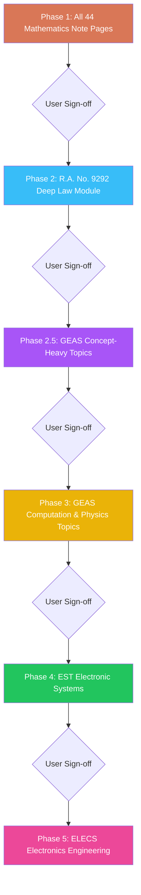

# Phased Learning Modules & Mastery Challenges Authoring Master Plan

This plan establishes the strict, phased execution roadmap for authoring all **Interactive Learning Modules** and **Paired Mastery Challenges** across Mathematics, GEAS, EST, and Electronics Engineering on the Marnie Quiz platform.

---

## 1. Operating Rules & Core Source of Truth

1. **The Absolute Reference Source (1-to-1 Note Page Inspection)**:
   - Every single module and companion mastery challenge MUST be engineered directly from the rendered review note page PNG image located in:
     `test-sets/scratch/pdf-renders/[subject]/notes___[topic]_[n]/page_01.png`
   - **Zero-Skipping Rule**: The authoring agent MUST call `view_file` on the specific `page_01.png` image first, read every single formula, table, theorem, diagram, and condition on that page, and ensure **100% of the page's contents** are transcribed and enriched into the module.
   - **No Batching**: Modules must be authored one page at a time (Inspect Page PNG $\to$ Author Module JSON $\to$ Author Paired Mastery JSON $\to$ Verify). Never batch-generate or summarize away distinct note pages.

2. **Pedagogical & Authoring Skills**:
   - [`.agents/skills/learning-module-authoring/SKILL.md`](file:///c:/Users/reyna/OneDrive/Documents/marnie_quiz/.agents/skills/learning-module-authoring/SKILL.md): Lesson-first hierarchy, 4-layer theory flow (Intuition $\to$ Formula $\to$ Specific Cases $\to$ Trap Alert), compilation of formulas cards, inline declarative SVG diagrams (`InlineFigure`), clean keycap arrays, and dual-method sample problems.
   - [`.agents/skills/mastery-challenge-authoring/SKILL.md`](file:///c:/Users/reyna/OneDrive/Documents/marnie_quiz/.agents/skills/mastery-challenge-authoring/SKILL.md): Decoupled 20–25 question exams with strict **4-Quadrant Balance Protocol** (30% conceptual, 35% computational, 20% applied, 15% shortcuts/traps) and direct distractor deconstructions.

3. **Quality & Error Prevention**:
   - [`test-sets/Reference Documents/learning-modules-authoring-pitfalls.md`](file:///c:/Users/reyna/OneDrive/Documents/marnie_quiz/test-sets/Reference%20Documents/learning-modules-authoring-pitfalls.md): Mandatory pre-flight checklist preventing academic jargon, faded text, missing slider tracks, or unescaped JSON characters.

4. **Phase Boundary & Gating Rule**:
   - **Strict Gating**: Build only the current authorized phase. **Do not proceed to the next phase without explicit approval from the user.**

5. **Strategic Milestone Pause**:
   - After completing Phase 1 (Mathematics) or Phase 2 (RA 9292), module authoring may be paused to finalize the **BYOK AI Features** (creating a complete, functional MVP) before resuming subsequent module batches on the side.

---

## 2. Phased Execution Roadmap

---

### Phase 1: Mathematics Curriculum (44 Note Pages $\to$ 44 Modules & Mastery Sets)

Every folder in `test-sets/scratch/pdf-renders/math/` maps 1-to-1 to a dedicated learning module and paired mastery challenge:

| # | Note Folder in `pdf-renders/math` | Module ID | Title & Topic Scope | Status |
| :-: | :--- | :--- | :--- | :-: |
| 1 | `notes___algebra_1` | `math-01-01` | Number Sets, Roman Numerals, Cyclic $i$, Prefixes & Multipliers | Pending |
| 2 | `notes___algebra_2` | `math-01-02` | Exponents, Radicals, Surds & Logarithmic Laws | Pending |
| 3 | `notes___algebra_3` | `math-01-03` | Polynomials, Special Products, Factoring & Remainder Theorem | Pending |
| 4 | `notes___algebra_4` | `math-01-04` | Quadratics, Discriminant, Vieta's Relations & Partial Fractions | Pending |
| 5 | `notes_algebra_1` | `math-01-05` | Algebraic Word Problems (Age, Work, Motion, Clock, Mixture) | Pending |
| 6 | `notes___discrete_math_1` | `math-04-01` | Arithmetic, Geometric & Harmonic Progressions & Means | Pending |
| 7 | `notes___discrete_math_2` | `math-04-02` | Permutations, Combinations, Partitioning & Counting Principles | Pending |
| 8 | `notes___discrete_math_3` | `math-04-03` | Set Theory, Venn Diagrams & Mathematical Logic | Pending |
| 9 | `notes___probability_1` | `math-06-01` | Fundamental Probability Laws, Conditional Events & Independence | Pending |
| 10 | `notes___probability_2` | `math-06-02` | Bayes' Theorem, Total Probability & Tree Diagrams | Pending |
| 11 | `notes___probability_3` | `math-06-03` | Probability Distributions (Binomial, Poisson, Normal) & Expected Value | Pending |
| 12 | `notes___trigonometry_1` | `math-08-01` | Angle Measurement Units (deg/rad/grad/mil) & Unit Circle Ratios | Pending |
| 13 | `notes___trigonometry_2` | `math-08-02` | Pythagorean, Angle Sum/Difference & Double/Half Angle Identities | Pending |
| 14 | `notes___trigonometry_3` | `math-08-03` | Inverse Trigonometric Functions, Equations & Waveform Graphs | Pending |
| 15 | `notes___trigonometry_4` | `math-08-04` | Oblique Triangles (Law of Sines/Cosines/Tangents) & Spherical Trig | Pending |
| 16 | `notes___plane_geometry_1` | `math-10-01` | Triangles: Congruence, Similarity, 4 Centers & Heron's Formula | Pending |
| 17 | `notes___plane_geometry_2` | `math-10-02` | Quadrilaterals, Cyclic Quads, Brahmagupta & Ptolemy's Theorem | Pending |
| 18 | `notes___plane_geometry_3` | `math-10-03` | Regular Polygons: Interior Angles, Diagonals & Apothem Areas | Pending |
| 19 | `notes___plane_geometry_4` | `math-10-04` | Circles: Sectors, Segments, Intersecting Chords & Secant-Tangents | Pending |
| 20 | `notes___plane_geometry_5` | `math-10-05` | Geometric Theorems: Euler Line, Nine-Point Circle, Ceva & Menelaus | Pending |
| 21 | `notes___solid_geometry_1` | `math-11-01` | Prisms, Cylinders, Pyramids, Cones & Frustums | Pending |
| 22 | `notes___solid_geometry_2` | `math-11-02` | Spheres, Spherical Zones, Segments, Lune & Prismoidal Formula | Pending |
| 23 | `notes___solid_geometry_3` | `math-11-03` | 5 Platonic Solids, Euler Polyhedral Formula & Archimedes Ratios | Pending |
| 24 | `notes___analytic_geometry_1` | `math-12-01` | Straight Lines, Slopes, Inclination Angles & Normal Distance Drops | Completed |
| 25 | `notes___analytic_geometry_2` | `math-12-02` | Shoelace Polygon Area, Centroids, Division of Segments & Polars | Completed |
| 26 | `notes___analytic_geometry_3` | `math-13-01` | Conic General Form $Ax^2+Bxy+Cy^2+\dots$, Circles & Parabolas | Completed |
| 27 | `notes___analytic_geometry_4` | `math-13-02` | Conic Sections: Ellipses, Hyperbolas & Unified Polar Conics | Completed |
| 28 | `notes___differential_calculus_1` | `math-14-01` | Limits, Indeterminate Forms, L'Hôpital's Rule & Continuity | Pending |
| 29 | `notes___differential_calculus_2` | `math-14-02` | Standard Derivatives: Algebraic, Trig, Inverse, Exp, Log, Hyperbolic | Pending |
| 30 | `notes___differential_calculus_3` | `math-14-03` | Higher Derivatives, Implicit Differentiation, Tangents & Normals | Pending |
| 31 | `notes___differential_calculus_4` | `math-14-04` | Critical Points, Maxima/Minima, Related Rates & Curvature | Pending |
| 32 | `notes___integral_calculus_1` | `math-16-01` | Antiderivatives, Integration by Parts & Trigonometric Substitutions | Pending |
| 33 | `notes___integral_calculus_2` | `math-16-02` | Wallis' Definite Formulas, Symmetries & Numerical Integration | Pending |
| 34 | `notes___integral_calculus_3` | `math-16-03` | Areas, Volumes (Disk/Washer/Shell), Centroids, Arc Length & Pappus | Pending |
| 35 | `notes___de_1` | `math-18-01` | Classification (Order/Degree), Separable, Homogeneous & Exact ODEs | Pending |
| 36 | `notes___de_2` | `math-18-02` | 1st-Order Linear ODEs, Euler Multipliers, Bernoulli & Trajectories | Pending |
| 37 | `notes___de_3` | `math-18-03` | Physical Applications: Growth/Decay, Newton Cooling, Mixing & Transients | Pending |
| 38 | `notes___advanced_math_1` | `math-20-01` | Complex Numbers: Representations, Operations, Modulus & Argument | Pending |
| 39 | `notes___advanced_math_2` | `math-20-02` | De Moivre's Theorem, $n$-th Root Polygons, Complex Logs & Powers ($j^j$) | Pending |
| 40 | `notes___advanced_math_3` | `math-21-01` | Matrix Operations, Determinants, Adjugate, Inverses & Cramer's Rule | Pending |
| 41 | `notes___advanced_math_4` | `math-21-02` | Eigenvalues, Eigenvectors, Trace Relations, Characteristic Eq & Rank | Pending |
| 42 | `notes___advanced_math_5` | `math-22-01` | Laplace Transforms: Definition, Pairs, 1st & 2nd Shifting Theorems | Pending |
| 43 | `notes___advanced_math_6` | `math-22-02` | Inverse Laplace, Partial Fractions, Initial/Final Value Theorems & ODEs | Pending |
| 44 | `notes___advanced_math_7` | `math-23-01` | Fourier Series, Symmetries, Fourier Transforms & Discrete Z-Transforms | Pending |

---

### Phase 2: R.A. No. 9292 (Deep Law & Ethics Module)

- **Goal**: Author an exhaustive, high-yield learning module and companion 25-item mastery set for Republic Act No. 9292 (Electronics Engineering Law of 2004).
- **Reference Blueprint**: Rendered law note pages and statutory review text.
- **Special Directives**:
  - **Comprehensive Scope**: Must cover all **8 Articles and 43 Sections** of the law.
  - **Break down into multiple modules and mastery exams if necessary** (recommended, due to length and detail)
  - **High Detail**: Explicit breakdowns for:
    - Scopes of practice: Professional Electronics Engineer (PECE), Electronics Engineer (ECE), Electronics Technician (ECT).
    - Qualifications and requirements (PECE 7-year experience requirement, 3 certifiers).
    - Board composition, powers, qualifications, and 3-year term limits.
    - Licensure examination ratings: General average $\ge 70\%$ with no subject below $60\%$; Removal exams.
    - PECE Official Dry Seal dimensions ($48\text{ mm}$ outer, $32\text{ mm}$ inner diameter) and stamping rules.
    - Penal provisions: Fines ($\text{₱100,000}$ to $\text{₱1,000,000}$) and imprisonment ($6\text{ months}$ to $6\text{ years}$).
  - **Files**: `geas-17.json` and `geas-17-mastery.json`.

---

### Phase 2.5: GEAS Concept-Heavy Topics (Qualitative & Memorization)

- **Goal**: Author all qualitative, definition-first GEAS modules that require minimal mathematical solving but high memory retention.
- **Target Modules (8 Modules)**:
  1. **Chemistry Suite (`GEAS-01` to `GEAS-05`)**: Matter, Atomic Models, Quantum Numbers, Periodic Trends, Gas Laws, Solutions, Electrochemistry & Polymers.
  2. **Material Science & Engineering (`GEAS-08`, `GEAS-09`)**: Crystal Unit Cells, APF, Miller Indices, Stress-Strain Curve, Hardness & Alloys.
  3. **Technopreneurship & Intellectual Property (`GEAS-18`)**: Business Model Canvas, Accounting equation, and R.A. 8293 IP Protection terms.

---

### Phase 3: The Rest of GEAS (Computation & Physics Suite)

- **Goal**: Author all computation-heavy engineering, mechanics, thermodynamics, and physics modules.
- **Target Modules (12 Modules)**:
  1. **Engineering Economics (`GEAS-06`, `GEAS-07`)**: Simple/Compound Interest, Annuities, Perpetuities & Depreciation.
  2. **Engineering Mechanics (`GEAS-10`, `GEAS-11`, `GEAS-12`)**: Statics, Friction, Centroids, Moments of Inertia, Kinematics & Projectiles.
  3. **Physics (`GEAS-13` to `GEAS-16`)**: Work-Energy, Impulse-Momentum, Waves, Sound (dB), Photometry & Geometric Optics.
  4. **Thermodynamics (`GEAS-19` to `GEAS-21`)**: Heat Transfer, Kinetic Theory, 1st Law Processes & 2nd Law Heat Engines.

---

### Phase 4: Electronic Systems and Technologies (EST Suite)

- **Goal**: Author all digital communications, modulation, and signal processing modules from rendered note sheets.
- **Target Modules**: Digital Transmission, BFSK, $M$-ary PSK/QAM Constellations, Pulse Modulation (PAM/PWM/PPM/PCM), Quantization, Companding & Delta Modulation.

---

### Phase 5: Electronics Engineering (ELECS Suite)

- **Goal**: Author all foundational electricity, network theorems, AC circuits, and waveform modules from rendered note sheets.
- **Target Modules**: DC Circuits, Series/Parallel Resistors, Kirchhoff Laws, Mesh/Nodal, Thévenin/Norton, AC Parameters, Phasors, RLC Resonance & Power Factor Correction.
