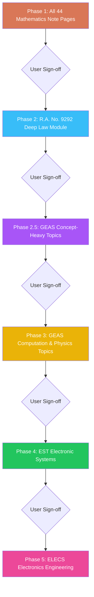

# Phased Learning Modules & Mastery Challenges Authoring Master Plan

This plan establishes the strict, phased execution roadmap for authoring all **Interactive Learning Modules** and **Paired Mastery Challenges** across Mathematics, GEAS, EST, and Electronics Engineering on the Marnie Quiz platform.

---

## 1. Operating Rules & Core Source of Truth

1. **The Absolute Reference Source (1-to-1 Note Page Inspection)**:
   - Every single module and companion mastery challenge MUST be engineered directly from the rendered review note page PNG image located in:
     `test-sets/scratch/pdf-renders/[subject]/notes___[topic]_[n]/page_01.png`
   - **Zero-Skipping Rule**: The authoring agent MUST call `view_file` on the specific `page_01.png` image first, read every single formula, table, theorem, diagram, and condition on that page, and ensure **100% of the page's contents** are transcribed and enriched into the module.
   - **No Batching**: Modules must be authored one page at a time (Inspect Page PNG $\to$ Author Module JSON $\to$ Author Paired Mastery JSON $\to$ Verify). Never batch-generate or summarize away distinct note pages.

2. **Pedagogical & Authoring Skills**:
   - [`.agents/skills/learning-module-authoring/SKILL.md`](file:///c:/Users/reyna/OneDrive/Documents/marnie_quiz/.agents/skills/learning-module-authoring/SKILL.md): Lesson-first hierarchy, 4-layer theory flow (Intuition $\to$ Formula $\to$ Specific Cases $\to$ Trap Alert), compilation of formulas cards, inline declarative SVG diagrams (`InlineFigure`), clean keycap arrays, and dual-method sample problems.
   - [`.agents/skills/mastery-challenge-authoring/SKILL.md`](file:///c:/Users/reyna/OneDrive/Documents/marnie_quiz/.agents/skills/mastery-challenge-authoring/SKILL.md): Decoupled 20–25 question exams with strict **4-Quadrant Balance Protocol** (30% conceptual, 35% computational, 20% applied, 15% shortcuts/traps) and direct distractor deconstructions.

3. **Quality & Error Prevention**:
   - [`test-sets/Reference Documents/learning-modules-authoring-pitfalls.md`](file:///c:/Users/reyna/OneDrive/Documents/marnie_quiz/test-sets/Reference%20Documents/learning-modules-authoring-pitfalls.md): Mandatory pre-flight checklist preventing academic jargon, faded text, missing slider tracks, or unescaped JSON characters.

4. **Phase Boundary & Gating Rule**:
   - **Strict Gating**: Build only the current authorized phase. **Do not proceed to the next phase without explicit approval from the user.**

5. **Strategic Milestone Pause**:
   - After completing Phase 1 (Mathematics) or Phase 2 (RA 9292), module authoring may be paused to finalize the **BYOK AI Features** (creating a complete, functional MVP) before resuming subsequent module batches on the side.

---

## 2. Phased Execution Roadmap

---

### Phase 1: Mathematics Curriculum (43 Modules & 43 Companion Mastery Sets — 100% Completed)

Every note page in `test-sets/scratch/pdf-renders/math/` maps 1-to-1 to a dedicated learning module and paired mastery challenge across 13 continuous, unbroken course codes:

| # | Note Folder in `pdf-renders/math` | Module ID | Topic Code | Topic Title & Subtopic Scope | Status |
| :-: | :--- | :--- | :--- | :--- | :-: |
| 1 | `notes___algebra_1` | `math-01-01` | `MATH-01` | **College Algebra:** Number Sets, Roman Numerals, Cyclic $i$, Prefixes & Multipliers | Completed |
| 2 | `notes___algebra_2` | `math-01-02` | `MATH-01` | **College Algebra:** Exponents, Radicals, Surds & Logarithmic Laws | Completed |
| 3 | `notes___algebra_3` | `math-01-03` | `MATH-01` | **College Algebra:** Polynomials, Special Products, Factoring & Remainder Theorem | Completed |
| 4 | `notes___algebra_4` | `math-01-04` | `MATH-01` | **College Algebra:** Quadratics, Discriminant, Vieta's Relations & Partial Fractions | Completed |
| 5 | `notes___discrete_math_1` | `math-02-01` | `MATH-02` | **Progressions & Discrete Math:** Arithmetic, Geometric & Harmonic Progressions & Means | Completed |
| 6 | `notes___discrete_math_2` | `math-02-02` | `MATH-02` | **Progressions & Discrete Math:** Permutations, Combinations, Partitioning & Counting | Completed |
| 7 | `notes___discrete_math_3` | `math-02-03` | `MATH-02` | **Progressions & Discrete Math:** Set Theory, Venn Diagrams & Mathematical Logic | Completed |
| 8 | `notes___probability_1` | `math-03-01` | `MATH-03` | **Probability & Statistics:** Fundamental Probability Laws, Conditional Events & Independence | Completed |
| 9 | `notes___probability_2` | `math-03-02` | `MATH-03` | **Probability & Statistics:** Bayes' Theorem, Total Probability & Tree Diagrams | Completed |
| 10 | `notes___probability_3` | `math-03-03` | `MATH-03` | **Probability & Statistics:** Probability Distributions (Binomial, Poisson, Normal) & Expectation | Completed |
| 11 | `notes___trigonometry_1` | `math-04-01` | `MATH-04` | **Plane & Spherical Trig:** Angle Measurement Units (deg/rad/grad/mil) & Unit Circle Ratios | Completed |
| 12 | `notes___trigonometry_2` | `math-04-02` | `MATH-04` | **Plane & Spherical Trig:** Pythagorean, Sum/Difference & Double/Half Angle Identities | Completed |
| 13 | `notes___trigonometry_3` | `math-04-03` | `MATH-04` | **Plane & Spherical Trig:** Inverse Trigonometric Functions, Equations & Waveform Graphs | Completed |
| 14 | `notes___trigonometry_4` | `math-04-04` | `MATH-04` | **Plane & Spherical Trig:** Oblique Triangles (Law of Sines/Cosines) & Spherical Trig | Completed |
| 15 | `notes___plane_geometry_1` | `math-05-01` | `MATH-05` | **Plane Geometry:** Triangles: Congruence, Similarity, 4 Centers & Heron's Formula | Completed |
| 16 | `notes___plane_geometry_2` | `math-05-02` | `MATH-05` | **Plane Geometry:** Quadrilaterals, Cyclic Quads, Brahmagupta & Ptolemy's Theorem | Completed |
| 17 | `notes___plane_geometry_3` | `math-05-03` | `MATH-05` | **Plane Geometry:** Regular Polygons: Interior Angles, Diagonals & Apothem Areas | Completed |
| 18 | `notes___plane_geometry_4` | `math-05-04` | `MATH-05` | **Plane Geometry:** Circles: Sectors, Segments, Intersecting Chords & Secant-Tangents | Completed |
| 19 | `notes___plane_geometry_5` | `math-05-05` | `MATH-05` | **Plane Geometry:** Geometric Theorems: Euler Line, Nine-Point Circle, Ceva & Menelaus | Completed |
| 20 | `notes___solid_geometry_1` | `math-06-01` | `MATH-06` | **Solid Geometry:** Prisms, Cylinders, Pyramids, Cones & Frustums | Completed |
| 21 | `notes___solid_geometry_2` | `math-06-02` | `MATH-06` | **Solid Geometry:** Spheres, Spherical Zones, Segments, Lune & Prismoidal Formula | Completed |
| 22 | `notes___solid_geometry_3` | `math-06-03` | `MATH-06` | **Solid Geometry:** 5 Platonic Solids, Euler Polyhedral Formula & Archimedes Ratios | Completed |
| 23 | `notes___analytic_geometry_1` | `math-07-01` | `MATH-07` | **Analytic Geometry:** Straight Lines, Slopes, Inclination Angles & Normal Distance Drops | Completed |
| 24 | `notes___analytic_geometry_2` | `math-07-02` | `MATH-07` | **Analytic Geometry:** Shoelace Polygon Area, Centroids, Division of Segments & Polars | Completed |
| 25 | `notes___analytic_geometry_3` | `math-07-03` | `MATH-07` | **Analytic Geometry:** Conic General Form $Ax^2+Bxy+Cy^2+\dots$, Circles & Parabolas | Completed |
| 26 | `notes___analytic_geometry_4` | `math-07-04` | `MATH-07` | **Analytic Geometry:** Conic Sections: Ellipses, Hyperbolas & Unified Polar Conics | Completed |
| 27 | `notes___differential_calculus_1` | `math-08-01` | `MATH-08` | **Differential Calculus:** Limits, Indeterminate Forms, L'Hôpital's Rule & Continuity | Completed |
| 28 | `notes___differential_calculus_2` | `math-08-02` | `MATH-08` | **Differential Calculus:** Standard Derivatives: Algebraic, Trig, Inverse, Exp, Log & Hyperbolic | Completed |
| 29 | `notes___differential_calculus_3` | `math-08-03` | `MATH-08` | **Differential Calculus:** Higher Derivatives, Implicit Differentiation, Tangents & Normals | Completed |
| 30 | `notes___differential_calculus_4` | `math-08-04` | `MATH-08` | **Differential Calculus:** Critical Points, Maxima/Minima, Related Rates & Curvature | Completed |
| 31 | `notes___integral_calculus_1` | `math-09-01` | `MATH-09` | **Integral Calculus:** Antiderivatives, Integration by Parts & Trigonometric Substitutions | Completed |
| 32 | `notes___integral_calculus_2` | `math-09-02` | `MATH-09` | **Integral Calculus:** Wallis' Definite Formulas, Symmetries & Numerical Integration | Completed |
| 33 | `notes___integral_calculus_3` | `math-09-03` | `MATH-09` | **Integral Calculus:** Areas, Volumes (Disk/Washer/Shell), Centroids, Arc Length & Pappus | Completed |
| 34 | `notes___de_1` | `math-10-01` | `MATH-10` | **Differential Equations:** Classification (Order/Degree), Separable, Homogeneous & Exact ODEs | Completed |
| 35 | `notes___de_2` | `math-10-02` | `MATH-10` | **Differential Equations:** 1st-Order Linear ODEs, Euler Multipliers, Bernoulli & Trajectories | Completed |
| 36 | `notes___de_3` | `math-10-03` | `MATH-10` | **Differential Equations:** Physical Applications: Growth/Decay, Newton Cooling, Mixing & Transients | Completed |
| 37 | `notes___advanced_math_1` | `math-11-01` | `MATH-11` | **Complex Numbers:** Representations, Operations, De Moivre's Theorem, nth Roots & Euler | Completed |
| 38 | `notes___advanced_math_3` | `math-12-01` | `MATH-12` | **Linear Algebra & Matrices:** Definitions, J.J. Sylvester, Matrix Taxonomy, Trace & Triangular | Completed |
| 39 | `notes___advanced_math_4` | `math-12-02` | `MATH-12` | **Linear Algebra & Matrices:** Operations: Symmetric/Skew-Symmetric, Addition & Multiplication | Completed |
| 40 | `notes___advanced_math_5` | `math-12-03` | `MATH-12` | **Linear Algebra & Matrices:** Determinants, Minors, Cofactors, Adjugate & Matrix Inversion | Completed |
| 41 | `notes___advanced_math_6` | `math-13-01` | `MATH-13` | **Advanced Transforms:** Determinant Pivotal Methods & Laplace Transform Elementary Pairs | Completed |
| 42 | `notes___advanced_math_7` | `math-13-02` | `MATH-13` | **Advanced Transforms:** Inverse Laplace Transforms, Partial Fractions & s-Domain ODEs | Completed |
| 43 | `notes___advanced_math_8` | `math-13-03` | `MATH-13` | **Advanced Transforms:** Fourier Series, Symmetries, Fourier Transforms & Discrete Z-Transforms | Completed |

---

### Phase 2: R.A. No. 9292 (Deep Law & Ethics Modules — 100% Completed)

- **Status**: **Completed (3 Modules & 3 Companion Mastery Sets — 75 Board Exam Items)**
- **Curriculum Taxonomy**: `GEAS-10: ECE Laws, Ethics & Contracts (RA 9292)`
- **Authored Modules**:
  1. **`geas-10-01`**: `Legislative Origins, The 8 Articles, 43 Sections & Definition of Terms` (`geas-10-01.json` + `geas-10-01-mastery.json`)
  2. **`geas-10-02`**: `ECE Board Structure, Powers, 3 Categories of Practice & Qualifications` (`geas-10-02.json` + `geas-10-02-mastery.json`)
  3. **`geas-10-03`**: `Licensure Ratings, PECE/Board Seals, Penal Provisions & Foreign Reciprocity` (`geas-10-03.json` + `geas-10-03-mastery.json`)
- **Key Invariants Verified**:
  - Full 1-to-1 transcription of `notes___r__a__no__9292_page_1` to `page_3`.
  - All 8 Articles & 43 Sections cataloged with Section 3 definitions.
  - Board composition (1 Chairman + 2 Members, 3-year term, max 6-year tenure, 10 years PECE practice).
  - Practice scopes & upgrade criteria (PECE 7-year experience, 2-year significant work, 3 PECE certs, oral interview).
  - Section 16 passing grades (GWA $\ge 70\%$, no score $< 70\%$, removal if $\ge 60\%$, results in 15 days).
  - Section 29 seal dimensions (PECE: $48\text{ mm}$ outer / $32\text{ mm}$ inner; Board: $48\text{ mm}$ outer / $28\text{ mm}$ inner).
  - Section 35 penal provisions ($\text{₱100,000}$ to $\text{₱1,000,000}$ fine and/or $6\text{ months}$ to $6\text{ years}$ imprisonment).
  - Section 26 foreign consultant 2-understudy rule & Section 33 foreign reciprocity.

---

### Phase 2.5: GEAS Concept-Heavy Topics (Qualitative & Memorization)

- **Goal**: Author all qualitative, definition-first GEAS modules that require minimal mathematical solving but high memory retention.
- **Target Modules (8 Modules)**:
  1. **Chemistry Suite (`GEAS-01` to `GEAS-05`)**: Matter, Atomic Models, Quantum Numbers, Periodic Trends, Gas Laws, Solutions, Electrochemistry & Polymers.
  2. **Material Science & Engineering (`GEAS-08`, `GEAS-09`)**: Crystal Unit Cells, APF, Miller Indices, Stress-Strain Curve, Hardness & Alloys.
  3. **Technopreneurship & Intellectual Property (`GEAS-18`)**: Business Model Canvas, Accounting equation, and R.A. 8293 IP Protection terms.

---

### Phase 3: The Rest of GEAS (Computation & Physics Suite)

- **Goal**: Author all computation-heavy engineering, mechanics, thermodynamics, and physics modules.
- **Target Modules (12 Modules)**:
  1. **Engineering Economics (`GEAS-06`, `GEAS-07`)**: Simple/Compound Interest, Annuities, Perpetuities & Depreciation.
  2. **Engineering Mechanics (`GEAS-10`, `GEAS-11`, `GEAS-12`)**: Statics, Friction, Centroids, Moments of Inertia, Kinematics & Projectiles.
  3. **Physics (`GEAS-13` to `GEAS-16`)**: Work-Energy, Impulse-Momentum, Waves, Sound (dB), Photometry & Geometric Optics.
  4. **Thermodynamics (`GEAS-19` to `GEAS-21`)**: Heat Transfer, Kinetic Theory, 1st Law Processes & 2nd Law Heat Engines.

---

### Phase 4: Electronic Systems and Technologies (EST Suite)

- **Goal**: Author all digital communications, modulation, and signal processing modules from rendered note sheets.
- **Target Modules**: Digital Transmission, BFSK, $M$-ary PSK/QAM Constellations, Pulse Modulation (PAM/PWM/PPM/PCM), Quantization, Companding & Delta Modulation.

---

### Phase 5: Electronics Engineering (ELECS Suite)

- **Goal**: Author all foundational electricity, network theorems, AC circuits, and waveform modules from rendered note sheets.
- **Target Modules**: DC Circuits, Series/Parallel Resistors, Kirchhoff Laws, Mesh/Nodal, Thévenin/Norton, AC Parameters, Phasors, RLC Resonance & Power Factor Correction.
